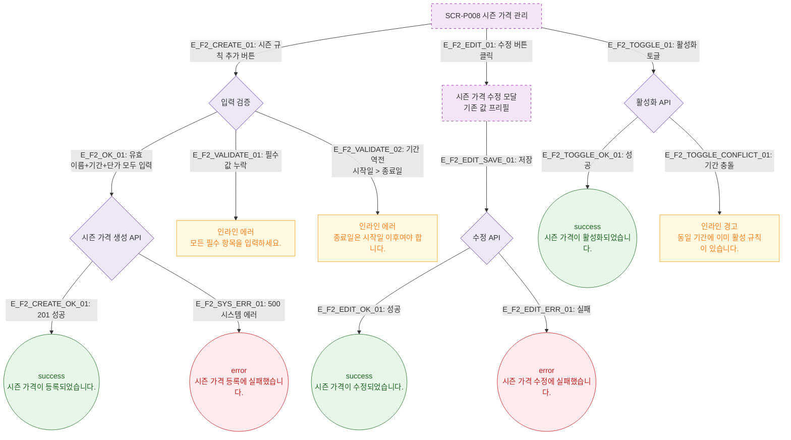

# F2 메인 인터랙션 플로우 — SCR-P008 시즌 가격 관리 🆕

## 목적
시즌 가격 규칙의 생성·수정·삭제·활성화 인터랙션을 정의하며, F2 의무 3갈래 분기(성공/검증실패/시스템에러)를 포함한다.

## 다이어그램

## TC 후보

| TC ID | 타입 | Given | When | Then |
|-------|------|-------|------|------|
| TC-P008-F2-01 | positive | 유효한 시즌 규칙 입력 | 추가 저장 | success 토스트 "시즌 가격이 등록되었습니다." |
| TC-P008-F2-02 | negative | 종료일 < 시작일 | 저장 시도 | 인라인 에러 "종료일은 시작일 이후여야 합니다." |
| TC-P008-F2-03 | negative | 기간 충돌 규칙 활성화 | 토글 ON | 인라인 경고 "동일 기간 활성 규칙 있음" |
| TC-P008-F2-04 | negative | API 500 | 시즌 가격 등록 | error 토스트 "등록에 실패했습니다." |
