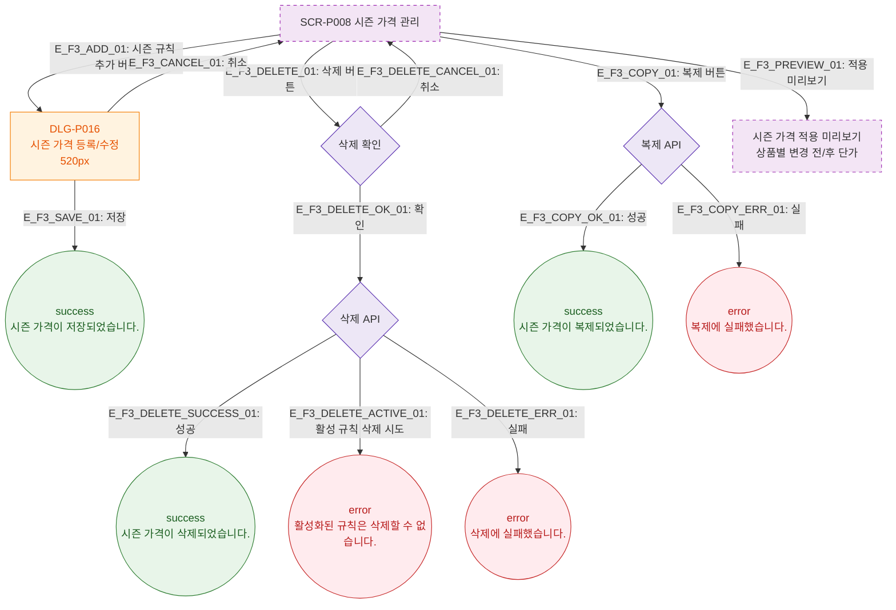

# F3 버튼 액션 플로우 — SCR-P008 시즌 가격 관리 🆕

## 다이어그램

## TC 후보

| TC ID | 타입 | Given | When | Then |
|-------|------|-------|------|------|
| TC-P008-F3-01 | positive | 시즌 규칙 추가 클릭 | 버튼 클릭 | DLG-P016 520px 모달 오픈 |
| TC-P008-F3-02 | negative | 활성화된 규칙 삭제 시도 | 삭제 확인 클릭 | error 토스트 "활성화된 규칙은 삭제할 수 없습니다." |
| TC-P008-F3-03 | positive | 규칙 복제 클릭 | 버튼 클릭 | success 토스트 "시즌 가격이 복제되었습니다." |
