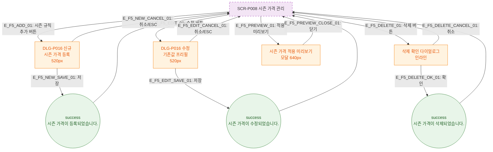

# F5 모달 트리거 트리 — SCR-P008 시즌 가격 관리 🆕

## 다이어그램

## TC 후보

| TC ID | 타입 | Given | When | Then |
|-------|------|-------|------|------|
| TC-P008-F5-01 | positive | 시즌 규칙 추가 클릭 | 버튼 클릭 | DLG-P016 신규 모달 오픈 |
| TC-P008-F5-02 | positive | 수정 버튼 클릭 | 버튼 클릭 | DLG-P016 기존값 프리필 모달 오픈 |
| TC-P008-F5-03 | positive | 삭제 확인 | 확인 클릭 | success 토스트 "시즌 가격이 삭제되었습니다." |
