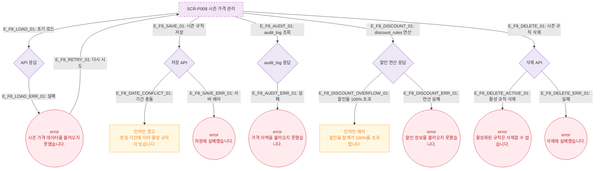

# F8 에러/예외/복구 플로우 — SCR-P008 시즌 가격 관리 🆕

## 목적
시즌 가격 관리 화면의 에러·예외 상황과 복구 경로를 정의하며, **가격이력(audit_log)**, **할인중첩(discount stacking)** 관련 에러를 상세화한다.

## 다이어그램

## TC 후보

| TC ID | 타입 | Given | When | Then |
|-------|------|-------|------|------|
| TC-P008-F8-01 | negative | 기간 충돌 규칙 저장 | 저장 시도 | 인라인 경고 "동일 기간 활성 규칙 있음" |
| TC-P008-F8-02 | negative | 할인율 합계 110% | 할인 연산 | 인라인 에러 "100% 초과" |
| TC-P008-F8-03 | negative | 활성 규칙 삭제 시도 | 삭제 확인 | error 토스트 "활성화된 규칙은 삭제할 수 없습니다." |
