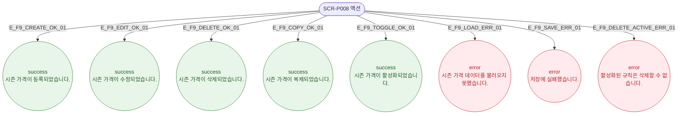

# F9 토스트/피드백 플로우 — SCR-P008 시즌 가격 관리 🆕

## 다이어그램

## TC 후보

| TC ID | 타입 | Given | When | Then |
|-------|------|-------|------|------|
| TC-P008-F9-01 | positive | 시즌 가격 등록 완료 | DLG-P016 저장 | success 토스트 "시즌 가격이 등록되었습니다." |
| TC-P008-F9-02 | positive | 시즌 가격 삭제 완료 | 삭제 확인 | success 토스트 "시즌 가격이 삭제되었습니다." |
| TC-P008-F9-03 | negative | 활성 규칙 삭제 시도 | 삭제 확인 | error 토스트 "활성화된 규칙은 삭제할 수 없습니다." |
