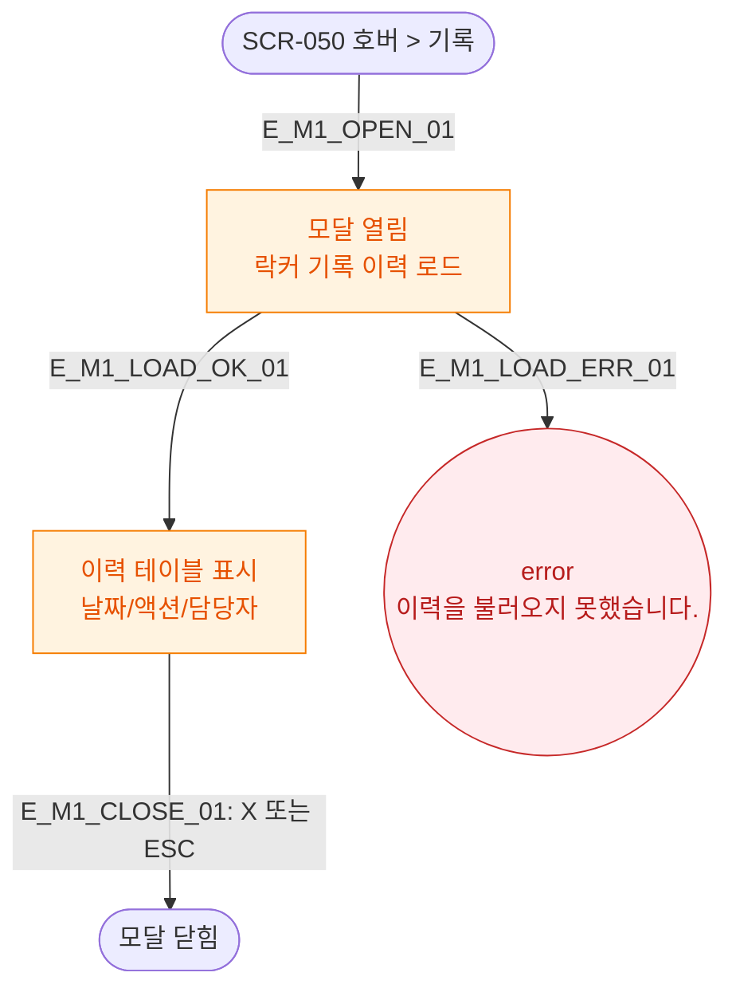

# M1 모달 생명주기 — DLG-050-001 락커 기록 모달

## 다이어그램

```mermaid
flowchart TD
    TRIGGER([SCR-050 호버 > 기록]) -->|E_M1_OPEN_01| OPEN[모달 열림\n락커 기록 이력 로드]
    OPEN -->|E_M1_LOAD_OK_01| READY[이력 테이블 표시\n날짜/액션/담당자]
    OPEN -->|E_M1_LOAD_ERR_01| LoadErr((error\n이력을 불러오지 못했습니다.))
    READY -->|E_M1_CLOSE_01: X 또는 ESC| CLOSED([모달 닫힘])

    classDef modal fill:#FFF3E0,stroke:#F57C00,color:#E65100
    classDef error fill:#FFEBEE,stroke:#C62828,color:#B71C1C
    classDef system fill:#EDE7F6,stroke:#5E35B2
    class OPEN,READY modal
    class LoadErr error
```

## TC 후보

| TC ID | 타입 | Given | When | Then |
|-------|------|-------|------|------|
| - | positive | 락커 호버 | 기록 버튼 클릭 | 기록 이력 모달 열림 |
