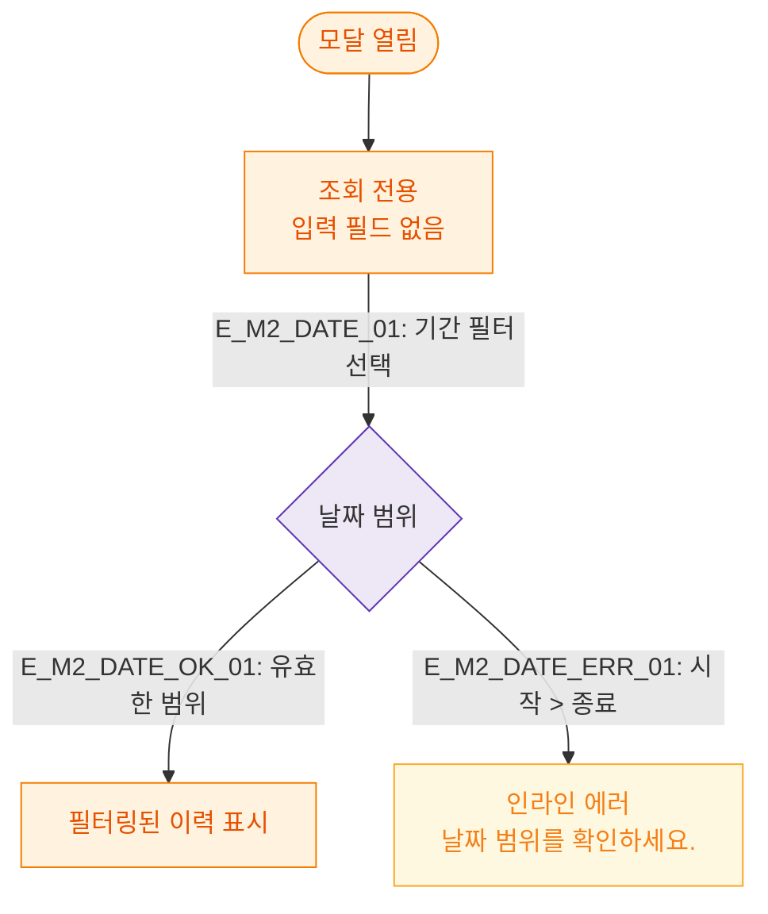

# M2 필드 검증 — DLG-050-001 락커 기록 모달

## 다이어그램

```mermaid
flowchart TD
    OPEN([모달 열림]) --> ReadOnly[조회 전용\n입력 필드 없음]
    ReadOnly -->|E_M2_DATE_01: 기간 필터 선택| DateFilter{날짜 범위}
    DateFilter -->|E_M2_DATE_OK_01: 유효한 범위| FilterResult[필터링된 이력 표시]
    DateFilter -->|E_M2_DATE_ERR_01: 시작 > 종료| DateErr[인라인 에러\n날짜 범위를 확인하세요.]

    classDef modal fill:#FFF3E0,stroke:#F57C00,color:#E65100
    classDef warning fill:#FFF8E1,stroke:#F9A825,color:#F57F17
    classDef system fill:#EDE7F6,stroke:#5E35B2
    class OPEN,ReadOnly,FilterResult modal
    class DateErr warning
    class DateFilter system
```

## TC 후보

| TC ID | 타입 | Given | When | Then |
|-------|------|-------|------|------|
| - | - | - | - | - |
