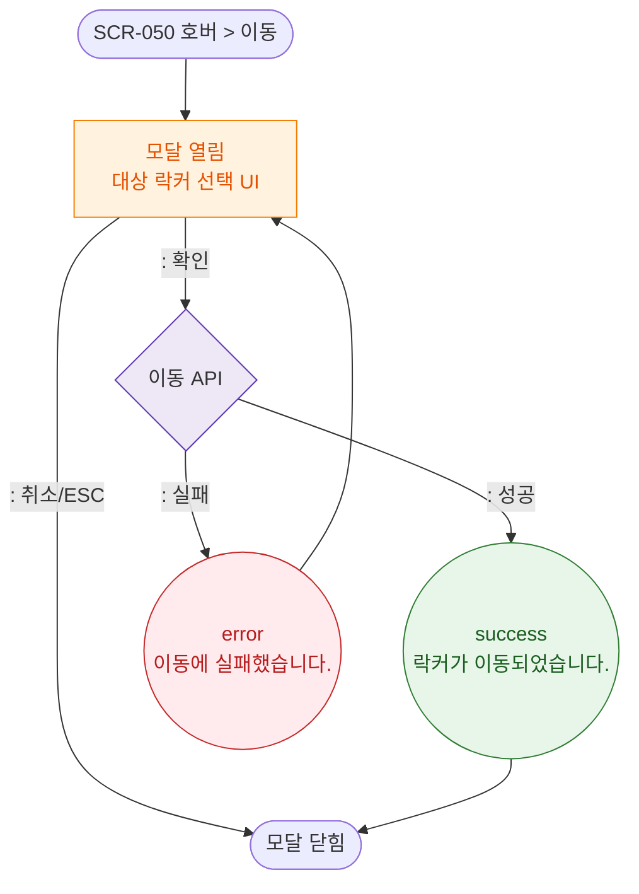

# M1 모달 생명주기 — DLG-050-002 락커 이동

## 다이어그램

```mermaid
flowchart TD
    TRIGGER([SCR-050 호버 > 이동]) --> OPEN[모달 열림\n대상 락커 선택 UI]
    OPEN -->|": 확인"|MoveAPI{이동 API}
    MoveAPI -->|": 성공"|SUCCESS((success\n락커가 이동되었습니다.))
    MoveAPI -->|": 실패"|FAIL((error\n이동에 실패했습니다.))
    OPEN -->|": 취소/ESC"|CLOSED([모달 닫힘])
    SUCCESS --> CLOSED
    FAIL --> OPEN

    classDef modal fill:#FFF3E0,stroke:#F57C00,color:#E65100
    classDef success fill:#E8F5E9,stroke:#2E7D32,color:#1B5E20
    classDef error fill:#FFEBEE,stroke:#C62828,color:#B71C1C
    classDef system fill:#EDE7F6,stroke:#5E35B2
    class OPEN modal
    class SUCCESS success
    class FAIL error
    class MoveAPI system
```

## TC 후보

| TC ID | 타입 | Given | When | Then | |-------|------|-------|------|------| | - | positive | 이동 모달 | 대상 선택 후 확인 | 락커 이동 성공, 그리드 갱신 |
