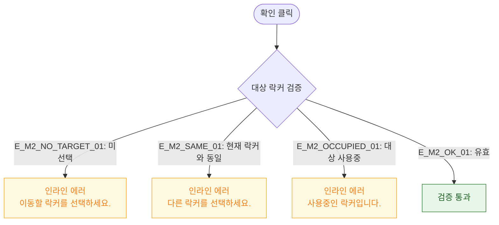

# M2 필드 검증 — DLG-050-002 락커 이동

## 다이어그램

```mermaid
flowchart TD
    SUBMIT([확인 클릭]) --> V1{대상 락커 검증}
    V1 -->|E_M2_NO_TARGET_01: 미선택| ErrTarget[인라인 에러\n이동할 락커를 선택하세요.]
    V1 -->|E_M2_SAME_01: 현재 락커와 동일| ErrSame[인라인 에러\n다른 락커를 선택하세요.]
    V1 -->|E_M2_OCCUPIED_01: 대상 사용중| ErrOccupied[인라인 에러\n사용중인 락커입니다.]
    V1 -->|E_M2_OK_01: 유효| PASS[검증 통과]

    classDef modal fill:#FFF3E0,stroke:#F57C00,color:#E65100
    classDef warning fill:#FFF8E1,stroke:#F9A825,color:#F57F17
    classDef success fill:#E8F5E9,stroke:#2E7D32,color:#1B5E20
    class PASS success
    class ErrTarget,ErrSame,ErrOccupied warning
```

## TC 후보

| TC ID | 타입 | Given | When | Then |
|-------|------|-------|------|------|
| - | negative | 대상 락커 미선택 | 확인 클릭 | 인라인 에러 표시 |
