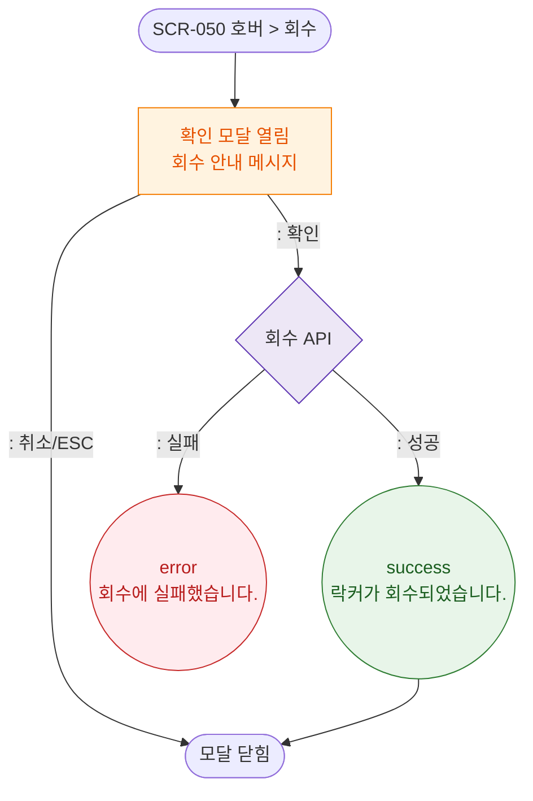

# M1 모달 생명주기 — DLG-050-003 락커 회수 확인

## 다이어그램

```mermaid
flowchart TD
    TRIGGER([SCR-050 호버 > 회수]) --> OPEN[확인 모달 열림\n회수 안내 메시지]
    OPEN -->|": 확인"|RevokeAPI{회수 API}
    RevokeAPI -->|": 성공"|SUCCESS((success\n락커가 회수되었습니다.))
    RevokeAPI -->|": 실패"|FAIL((error\n회수에 실패했습니다.))
    OPEN -->|": 취소/ESC"|CLOSED([모달 닫힘])
    SUCCESS --> CLOSED

    classDef modal fill:#FFF3E0,stroke:#F57C00,color:#E65100
    classDef success fill:#E8F5E9,stroke:#2E7D32,color:#1B5E20
    classDef error fill:#FFEBEE,stroke:#C62828,color:#B71C1C
    classDef system fill:#EDE7F6,stroke:#5E35B2
    class OPEN modal
    class SUCCESS success
    class FAIL error
    class RevokeAPI system
```

## TC 후보

| TC ID | 타입 | Given | When | Then | |-------|------|-------|------|------| | - | positive | 회수 모달 | 확인 클릭 | 락커 회수, available 상태 전환 |
