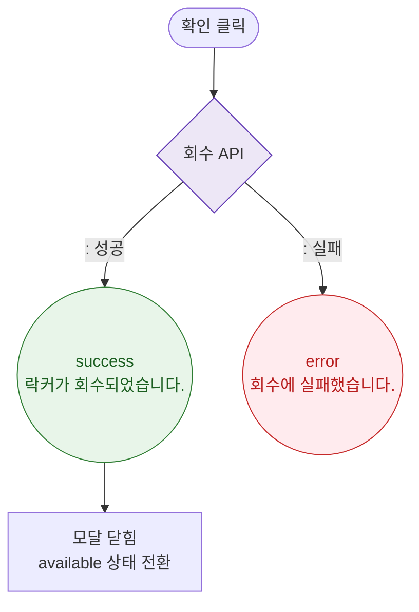

# M3 결과 분기 — DLG-050-003 락커 회수 확인

## 다이어그램

```mermaid
flowchart TD
    ACTION([확인 클릭]) --> RevokeAPI{회수 API}
    RevokeAPI -->|": 성공"|SuccessToast((success\n락커가 회수되었습니다.))
    RevokeAPI -->|": 실패"|ErrorToast((error\n회수에 실패했습니다.))
    SuccessToast --> CLOSE[모달 닫힘\navailable 상태 전환]

    classDef success fill:#E8F5E9,stroke:#2E7D32,color:#1B5E20
    classDef error fill:#FFEBEE,stroke:#C62828,color:#B71C1C
    classDef system fill:#EDE7F6,stroke:#5E35B2
    class SuccessToast success
    class ErrorToast error
    class RevokeAPI system
```

## TC 후보

| TC ID | 타입 | Given | When | Then | |-------|------|-------|------|------| | - | - | - | - | - |
