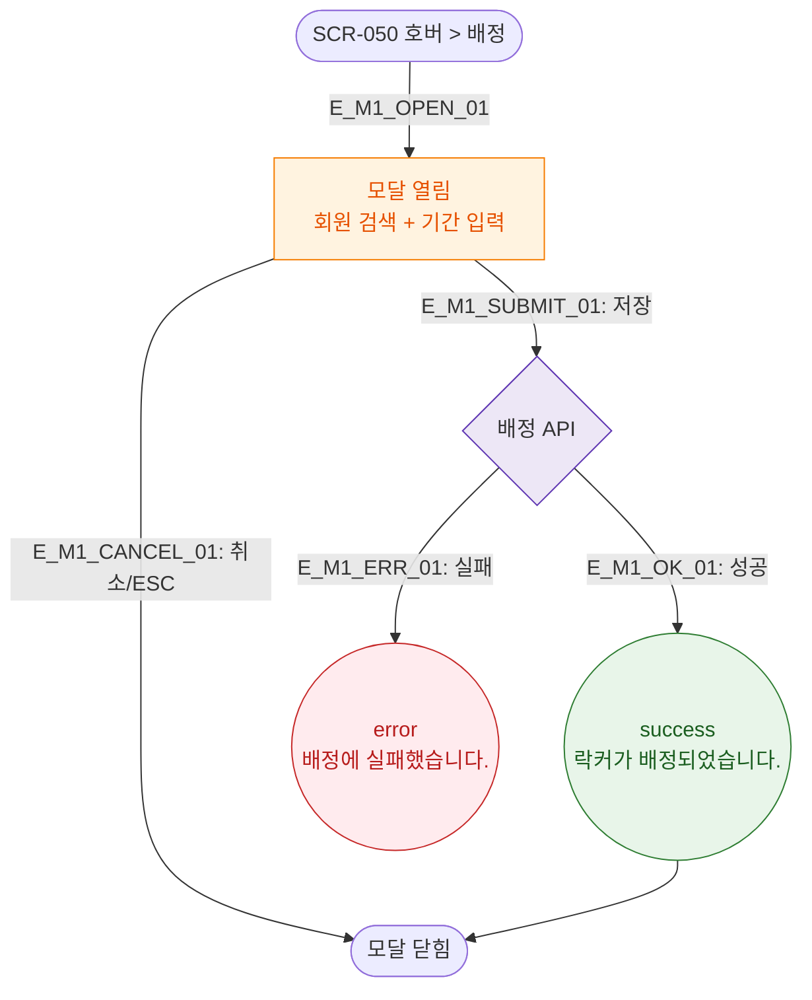

# M1 모달 생명주기 — DLG-050-004 개별 배정

## 다이어그램

```mermaid
flowchart TD
    TRIGGER([SCR-050 호버 > 배정]) -->|E_M1_OPEN_01| OPEN[모달 열림\n회원 검색 + 기간 입력]
    OPEN -->|E_M1_SUBMIT_01: 저장| AssignAPI{배정 API}
    AssignAPI -->|E_M1_OK_01: 성공| SUCCESS((success\n락커가 배정되었습니다.))
    AssignAPI -->|E_M1_ERR_01: 실패| FAIL((error\n배정에 실패했습니다.))
    OPEN -->|E_M1_CANCEL_01: 취소/ESC| CLOSED([모달 닫힘])
    SUCCESS --> CLOSED

    classDef modal fill:#FFF3E0,stroke:#F57C00,color:#E65100
    classDef success fill:#E8F5E9,stroke:#2E7D32,color:#1B5E20
    classDef error fill:#FFEBEE,stroke:#C62828,color:#B71C1C
    classDef system fill:#EDE7F6,stroke:#5E35B2
    class OPEN modal
    class SUCCESS success
    class FAIL error
    class AssignAPI system
```

## TC 후보

| TC ID | 타입 | Given | When | Then |
|-------|------|-------|------|------|
| - | positive | 개별 배정 모달 | 회원 선택 + 저장 | 락커 in_use 전환 |
