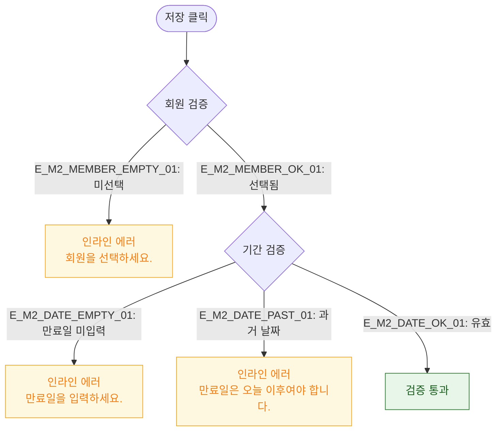

# M2 필드 검증 — DLG-050-004 개별 배정

## 다이어그램

```mermaid
flowchart TD
    SUBMIT([저장 클릭]) --> V1{회원 검증}
    V1 -->|E_M2_MEMBER_EMPTY_01: 미선택| ErrMember[인라인 에러\n회원을 선택하세요.]
    V1 -->|E_M2_MEMBER_OK_01: 선택됨| V2{기간 검증}
    V2 -->|E_M2_DATE_EMPTY_01: 만료일 미입력| ErrDate[인라인 에러\n만료일을 입력하세요.]
    V2 -->|E_M2_DATE_PAST_01: 과거 날짜| ErrPast[인라인 에러\n만료일은 오늘 이후여야 합니다.]
    V2 -->|E_M2_DATE_OK_01: 유효| PASS[검증 통과]

    classDef warning fill:#FFF8E1,stroke:#F9A825,color:#F57F17
    classDef success fill:#E8F5E9,stroke:#2E7D32,color:#1B5E20
    class ErrMember,ErrDate,ErrPast warning
    class PASS success
```

## TC 후보

| TC ID | 타입 | Given | When | Then |
|-------|------|-------|------|------|
| - | negative | 회원 미선택 | 저장 클릭 | 인라인 에러 "회원을 선택하세요." |
