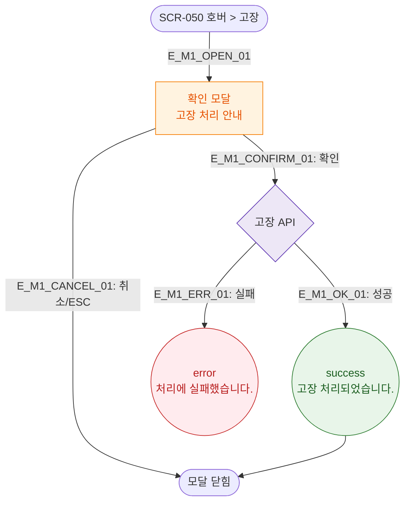

# M1 모달 생명주기 — DLG-050-005 고장 토글 확인

## 다이어그램

```mermaid
flowchart TD
    TRIGGER([SCR-050 호버 > 고장]) -->|E_M1_OPEN_01| OPEN[확인 모달\n고장 처리 안내]
    OPEN -->|"E_M1_CONFIRM_01: 확인"| BrokenAPI{고장 API}
    BrokenAPI -->|"E_M1_OK_01: 성공"| SUCCESS((success\n고장 처리되었습니다.))
    BrokenAPI -->|"E_M1_ERR_01: 실패"| FAIL((error\n처리에 실패했습니다.))
    OPEN -->|"E_M1_CANCEL_01: 취소/ESC"| CLOSED([모달 닫힘])
    SUCCESS --> CLOSED

    classDef modal fill:#FFF3E0,stroke:#F57C00,color:#E65100
    classDef success fill:#E8F5E9,stroke:#2E7D32,color:#1B5E20
    classDef error fill:#FFEBEE,stroke:#C62828,color:#B71C1C
    classDef system fill:#EDE7F6,stroke:#5E35B2
    class OPEN modal
    class SUCCESS success
    class FAIL error
    class BrokenAPI system
```

## TC 후보

| TC ID | 타입 | Given | When | Then |
|-------|------|-------|------|------|
| - | positive | 고장 확인 모달 | 확인 클릭 | broken 상태 전환 |
