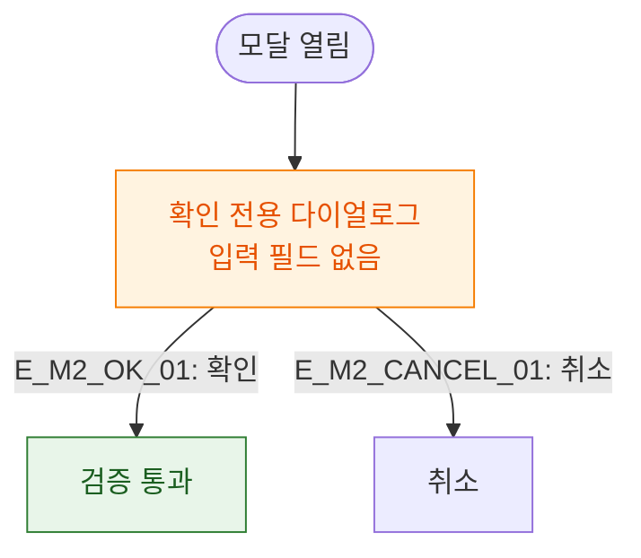

# M2 필드 검증 — DLG-050-005 고장 토글 확인

## 다이어그램

```mermaid
flowchart TD
    OPEN([모달 열림]) --> Confirm[확인 전용 다이얼로그\n입력 필드 없음]
    Confirm -->|E_M2_OK_01: 확인| PASS[검증 통과]
    Confirm -->|E_M2_CANCEL_01: 취소| CANCEL[취소]

    classDef modal fill:#FFF3E0,stroke:#F57C00,color:#E65100
    classDef success fill:#E8F5E9,stroke:#2E7D32,color:#1B5E20
    class Confirm modal
    class PASS success
```

## TC 후보

| TC ID | 타입 | Given | When | Then |
|-------|------|-------|------|------|
| - | - | - | - | - |
