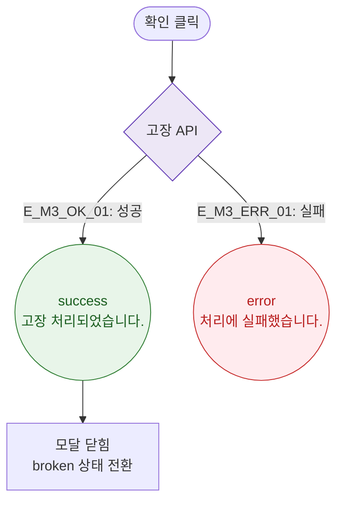

# M3 결과 분기 — DLG-050-005 고장 토글 확인

## 다이어그램

```mermaid
flowchart TD
    ACTION([확인 클릭]) --> BrokenAPI{고장 API}
    BrokenAPI -->|"E_M3_OK_01: 성공"| SuccessToast((success\n고장 처리되었습니다.))
    BrokenAPI -->|"E_M3_ERR_01: 실패"| ErrorToast((error\n처리에 실패했습니다.))
    SuccessToast --> CLOSE[모달 닫힘\nbroken 상태 전환]

    classDef success fill:#E8F5E9,stroke:#2E7D32,color:#1B5E20
    classDef error fill:#FFEBEE,stroke:#C62828,color:#B71C1C
    classDef system fill:#EDE7F6,stroke:#5E35B2
    class SuccessToast success
    class ErrorToast error
    class BrokenAPI system
```

## TC 후보

| TC ID | 타입 | Given | When | Then |
|-------|------|-------|------|------|
| - | - | - | - | - |
