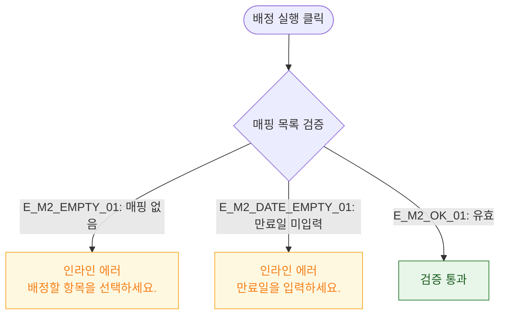

# M2 필드 검증 — DLG-050-006 일괄 배정

## 다이어그램

```mermaid
flowchart TD
    SUBMIT([배정 실행 클릭]) --> V1{매핑 목록 검증}
    V1 -->|"E_M2_EMPTY_01: 매핑 없음"| ErrEmpty[인라인 에러\n배정할 항목을 선택하세요.]
    V1 -->|"E_M2_DATE_EMPTY_01: 만료일 미입력"| ErrDate[인라인 에러\n만료일을 입력하세요.]
    V1 -->|"E_M2_OK_01: 유효"| PASS[검증 통과]

    classDef warning fill:#FFF8E1,stroke:#F9A825,color:#F57F17
    classDef success fill:#E8F5E9,stroke:#2E7D32,color:#1B5E20
    class ErrEmpty,ErrDate warning
    class PASS success
```

## TC 후보

| TC ID | 타입 | Given | When | Then |
|-------|------|-------|------|------|
| - | negative | 매핑 없이 실행 | 배정 실행 클릭 | 인라인 에러 표시 |
