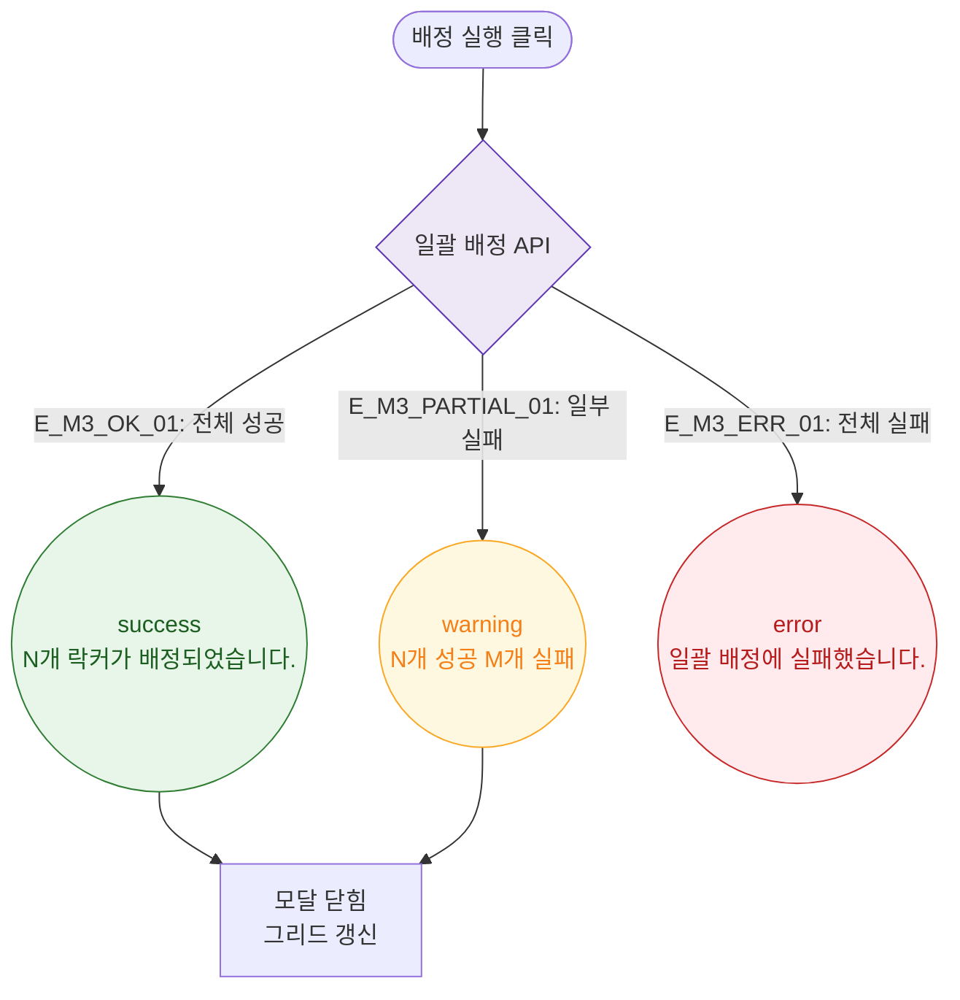

# M3 결과 분기 — DLG-050-006 일괄 배정

## 다이어그램

```mermaid
flowchart TD
    ACTION([배정 실행 클릭]) --> BulkAPI{일괄 배정 API}
    BulkAPI -->|E_M3_OK_01: 전체 성공| FullSuccess((success\nN개 락커가 배정되었습니다.))
    BulkAPI -->|E_M3_PARTIAL_01: 일부 실패| PartialWarn((warning\nN개 성공 M개 실패))
    BulkAPI -->|E_M3_ERR_01: 전체 실패| ErrorToast((error\n일괄 배정에 실패했습니다.))
    FullSuccess --> CLOSE[모달 닫힘\n그리드 갱신]
    PartialWarn --> CLOSE

    classDef success fill:#E8F5E9,stroke:#2E7D32,color:#1B5E20
    classDef warning fill:#FFF8E1,stroke:#F9A825,color:#F57F17
    classDef error fill:#FFEBEE,stroke:#C62828,color:#B71C1C
    classDef system fill:#EDE7F6,stroke:#5E35B2
    class FullSuccess success
    class PartialWarn warning
    class ErrorToast error
    class BulkAPI system
```

## TC 후보

| TC ID | 타입 | Given | When | Then |
|-------|------|-------|------|------|
| - | - | - | - | - |
