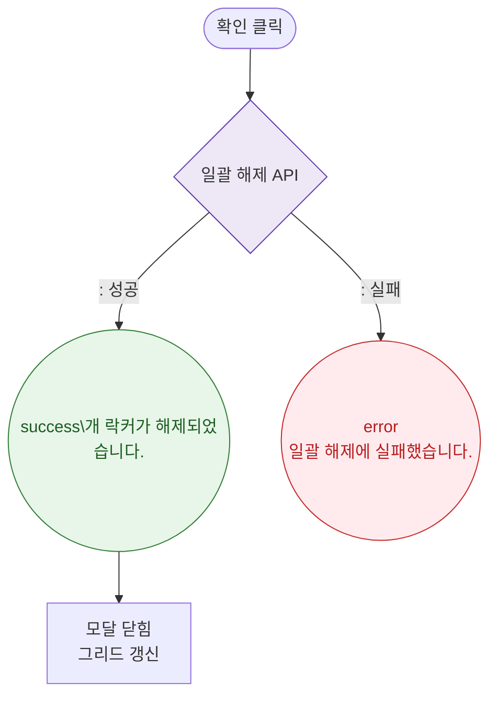

# M3 결과 분기 — DLG-050-007 일괄 해제 확인

## 다이어그램

```mermaid
flowchart TD
    ACTION([확인 클릭]) --> BulkAPI{일괄 해제 API}
    BulkAPI -->|": 성공"|SuccessToast((success\개 락커가 해제되었습니다.))
    BulkAPI -->|": 실패"|ErrorToast((error\n일괄 해제에 실패했습니다.))
    SuccessToast --> CLOSE[모달 닫힘\n그리드 갱신]

    classDef success fill:#E8F5E9,stroke:#2E7D32,color:#1B5E20
    classDef error fill:#FFEBEE,stroke:#C62828,color:#B71C1C
    classDef system fill:#EDE7F6,stroke:#5E35B2
    class SuccessToast success
    class ErrorToast error
    class BulkAPI system
```

## TC 후보

| TC ID | 타입 | Given | When | Then | |-------|------|-------|------|------| | - | - | - | - | - |
