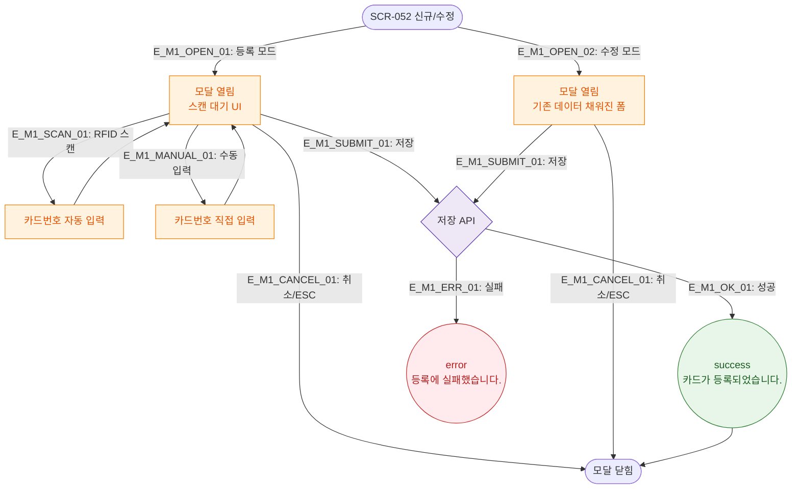

# M1 모달 생명주기 — DLG-052-001 RFID 등록/수정

## 다이어그램

## TC 후보

| TC ID | 타입 | Given | When | Then |
|-------|------|-------|------|------|
| TC-052-001 | positive | 등록 모드 | 스캔 + 저장 | success 토스트, 목록 추가 |
| TC-052-002 | positive | 수정 모드 | 데이터 수정 + 저장 | success 토스트, 데이터 갱신 |
