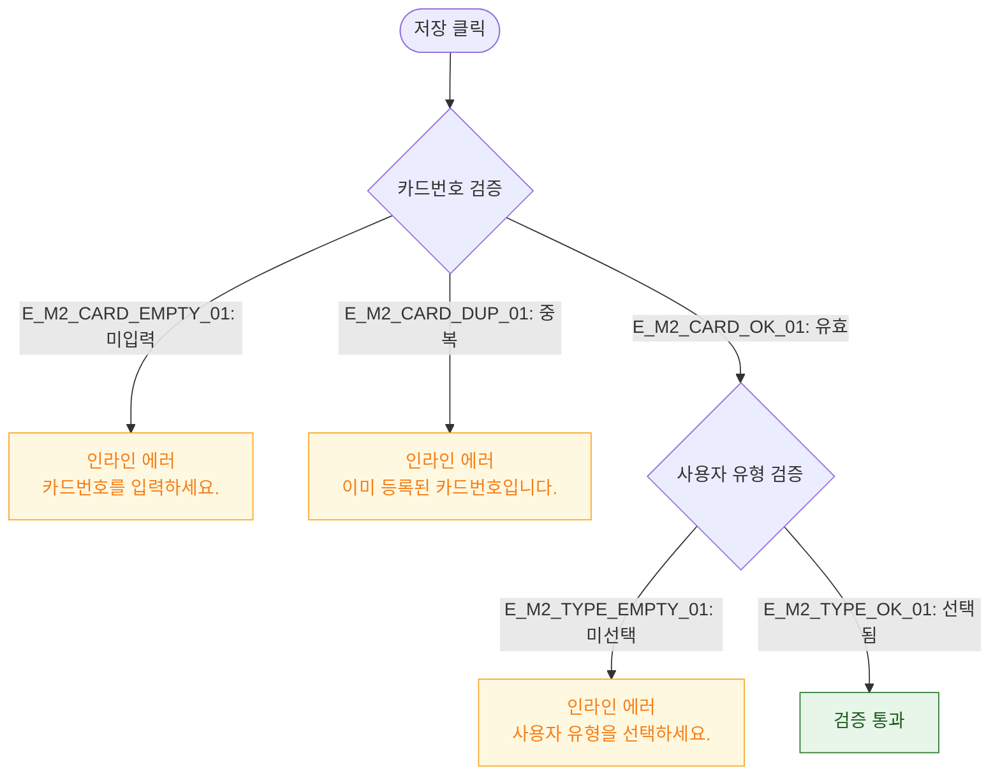

# M2 필드 검증 — DLG-052-001 RFID 등록/수정

## 다이어그램

```mermaid
flowchart TD
    SUBMIT([저장 클릭]) --> V1{카드번호 검증}
    V1 -->|E_M2_CARD_EMPTY_01: 미입력| ErrCard[인라인 에러\n카드번호를 입력하세요.]
    V1 -->|E_M2_CARD_DUP_01: 중복| ErrDup[인라인 에러\n이미 등록된 카드번호입니다.]
    V1 -->|E_M2_CARD_OK_01: 유효| V2{사용자 유형 검증}
    V2 -->|E_M2_TYPE_EMPTY_01: 미선택| ErrType[인라인 에러\n사용자 유형을 선택하세요.]
    V2 -->|E_M2_TYPE_OK_01: 선택됨| PASS[검증 통과]

    classDef warning fill:#FFF8E1,stroke:#F9A825,color:#F57F17
    classDef success fill:#E8F5E9,stroke:#2E7D32,color:#1B5E20
    class ErrCard,ErrDup,ErrType warning
    class PASS success
```

## TC 후보

| TC ID | 타입 | Given | When | Then |
|-------|------|-------|------|------|
| - | negative | 카드번호 중복 | 저장 클릭 | 인라인 에러 "이미 등록된 카드번호입니다." |
