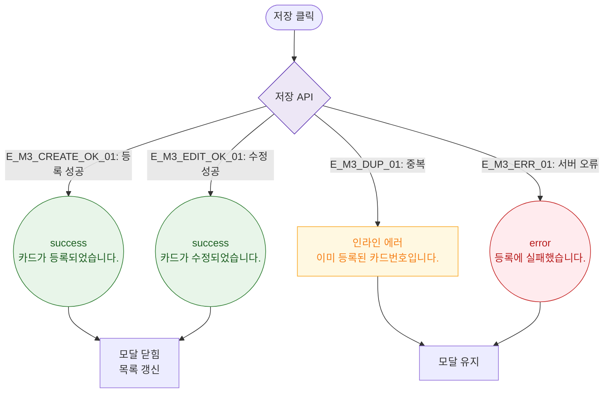

# M3 결과 분기 — DLG-052-001 RFID 등록/수정

## 다이어그램

```mermaid
flowchart TD
    ACTION([저장 클릭]) --> SaveAPI{저장 API}
    SaveAPI -->|"E_M3_CREATE_OK_01: 등록 성공"| CreateToast((success\n카드가 등록되었습니다.))
    SaveAPI -->|"E_M3_EDIT_OK_01: 수정 성공"| EditToast((success\n카드가 수정되었습니다.))
    SaveAPI -->|"E_M3_DUP_01: 중복"| DupErr[인라인 에러\n이미 등록된 카드번호입니다.]
    SaveAPI -->|"E_M3_ERR_01: 서버 오류"| ErrToast((error\n등록에 실패했습니다.))
    CreateToast & EditToast --> CLOSE[모달 닫힘\n목록 갱신]
    DupErr & ErrToast --> STAY[모달 유지]

    classDef success fill:#E8F5E9,stroke:#2E7D32,color:#1B5E20
    classDef error fill:#FFEBEE,stroke:#C62828,color:#B71C1C
    classDef warning fill:#FFF8E1,stroke:#F9A825,color:#F57F17
    classDef system fill:#EDE7F6,stroke:#5E35B2
    class CreateToast,EditToast success
    class ErrToast error
    class DupErr warning
    class SaveAPI system
```

## TC 후보

| TC ID | 타입 | Given | When | Then |
|-------|------|-------|------|------|
| TC-052-001 | positive | 등록 성공 | 저장 | success 토스트, 모달 닫힘 |
