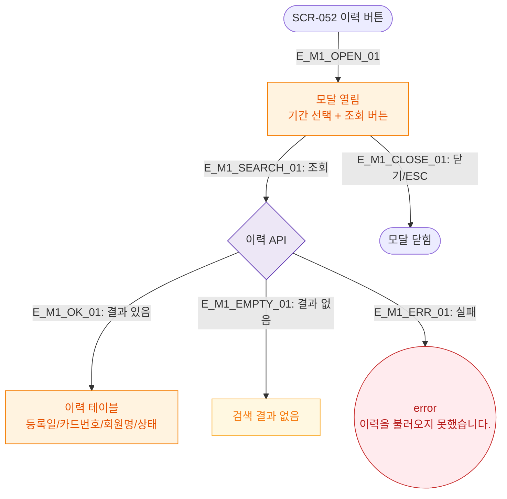

# M1 모달 생명주기 — DLG-052-002 RFID 이력 조회

## 다이어그램

```mermaid
flowchart TD
    TRIGGER([SCR-052 이력 버튼]) -->|E_M1_OPEN_01| OPEN[모달 열림\n기간 선택 + 조회 버튼]
    OPEN -->|E_M1_SEARCH_01: 조회| SearchAPI{이력 API}
    SearchAPI -->|E_M1_OK_01: 결과 있음| Result[이력 테이블\n등록일/카드번호/회원명/상태]
    SearchAPI -->|E_M1_EMPTY_01: 결과 없음| Empty[검색 결과 없음]
    SearchAPI -->|E_M1_ERR_01: 실패| ErrToast((error\n이력을 불러오지 못했습니다.))
    OPEN -->|E_M1_CLOSE_01: 닫기/ESC| CLOSED([모달 닫힘])

    classDef modal fill:#FFF3E0,stroke:#F57C00,color:#E65100
    classDef warning fill:#FFF8E1,stroke:#F9A825,color:#F57F17
    classDef error fill:#FFEBEE,stroke:#C62828,color:#B71C1C
    classDef system fill:#EDE7F6,stroke:#5E35B2
    class OPEN,Result modal
    class Empty warning
    class ErrToast error
    class SearchAPI system
```

## TC 후보

| TC ID | 타입 | Given | When | Then |
|-------|------|-------|------|------|
| TC-052-006 | positive | 이력 모달 | 기간 선택 후 조회 | 해당 기간 이력 표시 |
