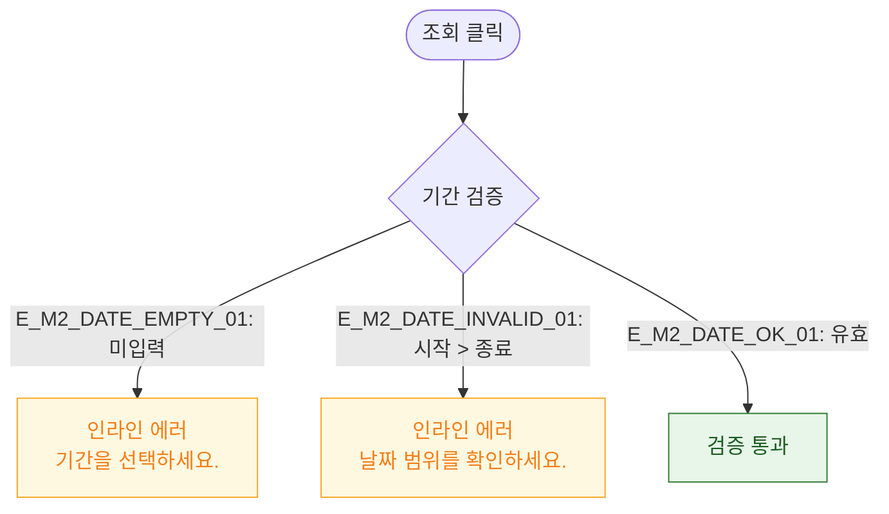

# M2 필드 검증 — DLG-052-002 RFID 이력 조회

## 다이어그램

```mermaid
flowchart TD
    SUBMIT([조회 클릭]) --> V1{기간 검증}
    V1 -->|E_M2_DATE_EMPTY_01: 미입력| ErrDate[인라인 에러\n기간을 선택하세요.]
    V1 -->|E_M2_DATE_INVALID_01: 시작 > 종료| ErrRange[인라인 에러\n날짜 범위를 확인하세요.]
    V1 -->|E_M2_DATE_OK_01: 유효| PASS[검증 통과]

    classDef warning fill:#FFF8E1,stroke:#F9A825,color:#F57F17
    classDef success fill:#E8F5E9,stroke:#2E7D32,color:#1B5E20
    class ErrDate,ErrRange warning
    class PASS success
```

## TC 후보

| TC ID | 타입 | Given | When | Then |
|-------|------|-------|------|------|
| - | - | - | - | - |
