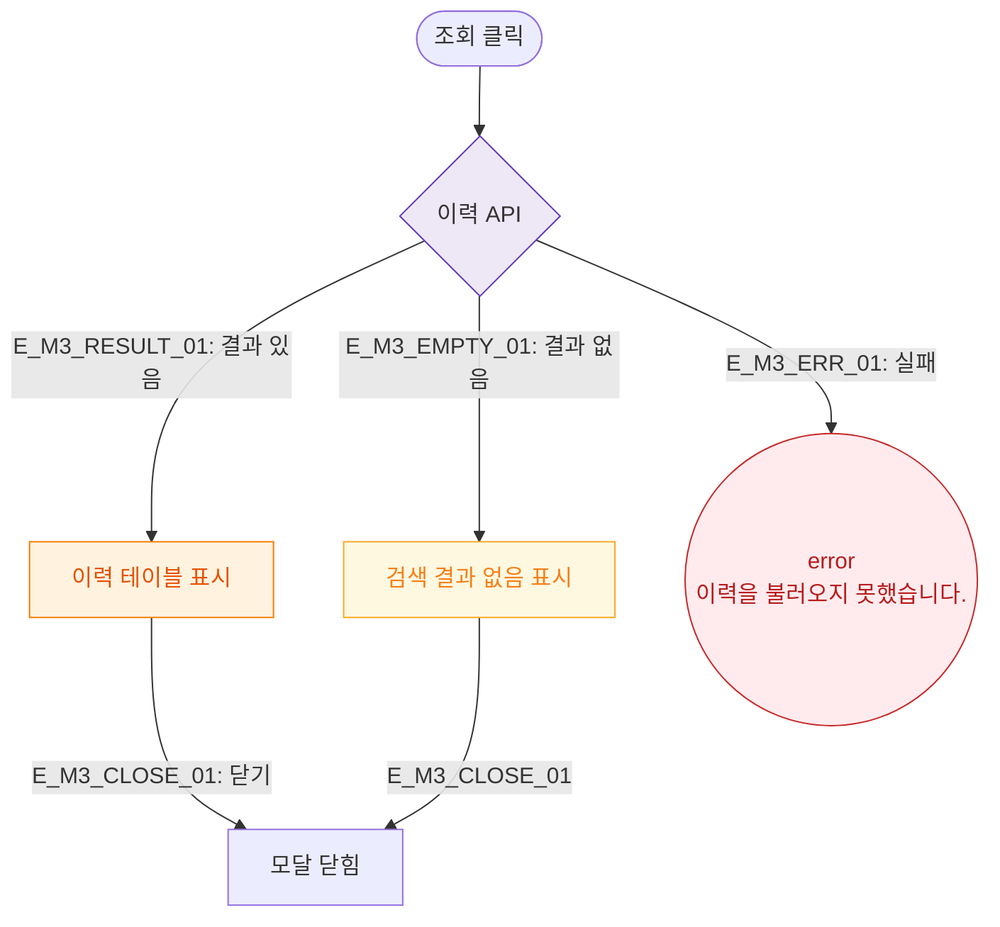

# M3 결과 분기 — DLG-052-002 RFID 이력 조회

## 다이어그램

```mermaid
flowchart TD
    ACTION([조회 클릭]) --> SearchAPI{이력 API}
    SearchAPI -->|"E_M3_RESULT_01: 결과 있음"| ShowResult[이력 테이블 표시]
    SearchAPI -->|"E_M3_EMPTY_01: 결과 없음"| ShowEmpty[검색 결과 없음 표시]
    SearchAPI -->|"E_M3_ERR_01: 실패"| ErrToast((error\n이력을 불러오지 못했습니다.))
    ShowResult -->|"E_M3_CLOSE_01: 닫기"| CLOSE[모달 닫힘]
    ShowEmpty -->|E_M3_CLOSE_01| CLOSE

    classDef modal fill:#FFF3E0,stroke:#F57C00,color:#E65100
    classDef warning fill:#FFF8E1,stroke:#F9A825,color:#F57F17
    classDef error fill:#FFEBEE,stroke:#C62828,color:#B71C1C
    classDef system fill:#EDE7F6,stroke:#5E35B2
    class ShowResult modal
    class ShowEmpty warning
    class ErrToast error
    class SearchAPI system
```

## TC 후보

| TC ID | 타입 | Given | When | Then |
|-------|------|-------|------|------|
| - | - | - | - | - |
