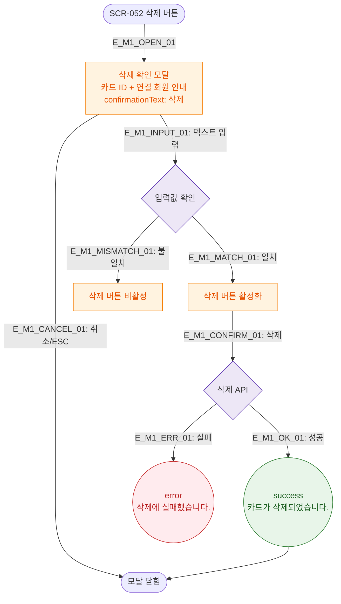

# M1 모달 생명주기 — DLG-052-003 RFID 삭제 확인

## 다이어그램

## TC 후보

| TC ID | 타입 | Given | When | Then |
|-------|------|-------|------|------|
| TC-052-005 | negative | 삭제 확인 입력 불일치 | "삭제" 외 입력 | 삭제 버튼 비활성 |
