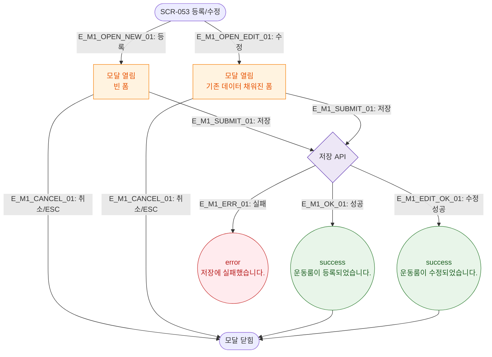

# M1 모달 생명주기 — DLG-053-001 룸 등록/수정

## 다이어그램

## TC 후보

| TC ID | 타입 | Given | When | Then |
|-------|------|-------|------|------|
| TC-053-002 | positive | 룸명 입력 | 저장 클릭 | success 토스트, 목록 추가 |
| TC-053-004 | positive | 수정 모드 | 데이터 수정 후 저장 | 수정 성공 토스트 |
