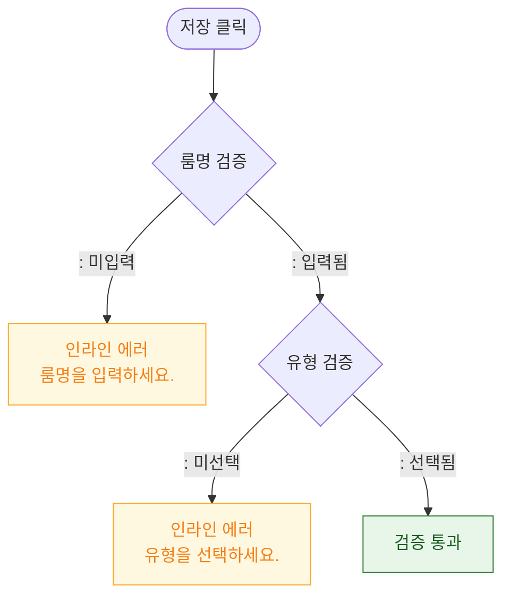

# M2 필드 검증 — DLG-053-001 룸 등록/수정

## 다이어그램

```mermaid
flowchart TD
    SUBMIT([저장 클릭]) --> V1{룸명 검증}
    V1 -->|": 미입력"|ErrName[인라인 에러\n룸명을 입력하세요.]
    V1 -->|": 입력됨"|V2{유형 검증}
    V2 -->|": 미선택"|ErrType[인라인 에러\n유형을 선택하세요.]
    V2 -->|": 선택됨"|PASS[검증 통과]

    classDef warning fill:#FFF8E1,stroke:#F9A825,color:#F57F17
    classDef success fill:#E8F5E9,stroke:#2E7D32,color:#1B5E20
    class ErrName,ErrType warning
    class PASS success
```

## TC 후보

| TC ID | 타입 | Given | When | Then | |-------|------|-------|------|------| | TC-053-003 | negative | 룸명 미입력 | 저장 클릭 | 인라인 에러 "룸명을 입력하세요." |
