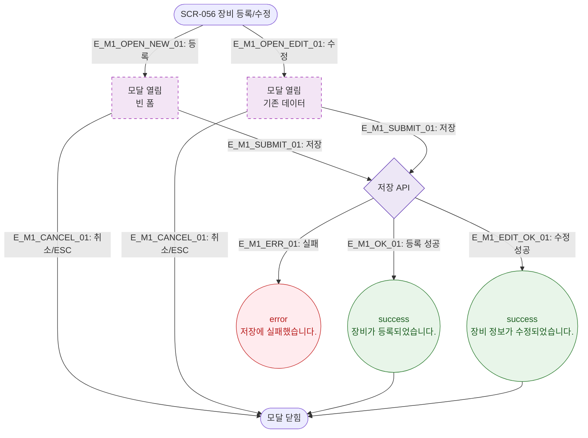

# M1 모달 생명주기 — DLG-056-001 장비 등록/수정 🆕

## 다이어그램

## TC 후보

| TC ID | 타입 | Given | When | Then |
|-------|------|-------|------|------|
| TC-056-002 | positive | 필수 필드 입력 | 저장 클릭 | success 토스트, 목록 추가 |
