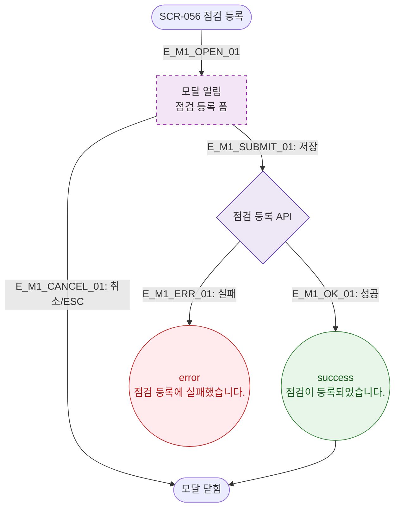

# M1 모달 생명주기 — DLG-056-002 점검 등록 🆕

## 다이어그램

## TC 후보

| TC ID | 타입 | Given | When | Then |
|-------|------|-------|------|------|
| TC-056-004 | positive | 필수 필드 입력 | 저장 클릭 | success 토스트 "점검이 등록되었습니다." |
