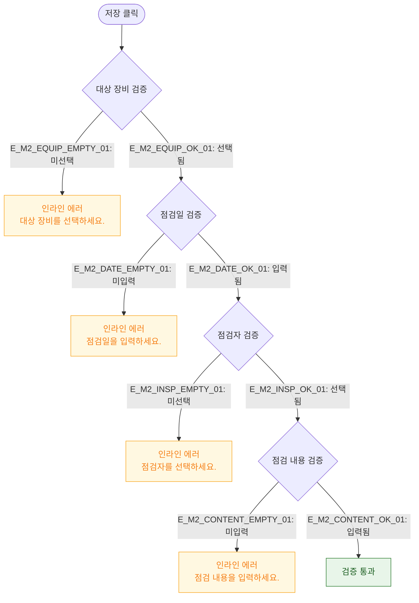

# M2 필드 검증 — DLG-056-002 점검 등록 🆕

## 다이어그램

```mermaid
flowchart TD
    SUBMIT([저장 클릭]) --> V1{대상 장비 검증}
    V1 -->|"E_M2_EQUIP_EMPTY_01: 미선택"| ErrEquip[인라인 에러\n대상 장비를 선택하세요.]
    V1 -->|"E_M2_EQUIP_OK_01: 선택됨"| V2{점검일 검증}
    V2 -->|"E_M2_DATE_EMPTY_01: 미입력"| ErrDate[인라인 에러\n점검일을 입력하세요.]
    V2 -->|"E_M2_DATE_OK_01: 입력됨"| V3{점검자 검증}
    V3 -->|"E_M2_INSP_EMPTY_01: 미선택"| ErrInsp[인라인 에러\n점검자를 선택하세요.]
    V3 -->|"E_M2_INSP_OK_01: 선택됨"| V4{점검 내용 검증}
    V4 -->|"E_M2_CONTENT_EMPTY_01: 미입력"| ErrContent[인라인 에러\n점검 내용을 입력하세요.]
    V4 -->|"E_M2_CONTENT_OK_01: 입력됨"| PASS[검증 통과]

    classDef warning fill:#FFF8E1,stroke:#F9A825,color:#F57F17
    classDef success fill:#E8F5E9,stroke:#2E7D32,color:#1B5E20
    class ErrEquip,ErrDate,ErrInsp,ErrContent warning
    class PASS success
```

## TC 후보

| TC ID | 타입 | Given | When | Then |
|-------|------|-------|------|------|
| - | negative | 대상 장비 미선택 | 저장 클릭 | 인라인 에러 표시 |
