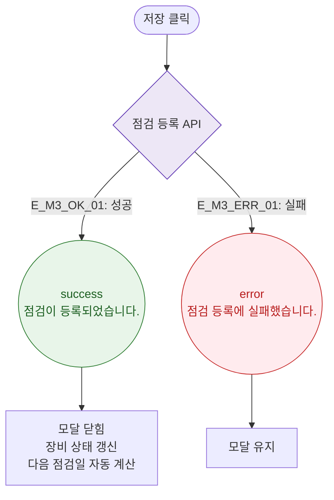

# M3 결과 분기 — DLG-056-002 점검 등록 🆕

## 다이어그램

```mermaid
flowchart TD
    ACTION([저장 클릭]) --> SaveAPI{점검 등록 API}
    SaveAPI -->|"E_M3_OK_01: 성공"| SuccessToast((success\n점검이 등록되었습니다.))
    SaveAPI -->|"E_M3_ERR_01: 실패"| ErrToast((error\n점검 등록에 실패했습니다.))
    SuccessToast --> CLOSE[모달 닫힘\n장비 상태 갱신\n다음 점검일 자동 계산]
    ErrToast --> STAY[모달 유지]

    classDef success fill:#E8F5E9,stroke:#2E7D32,color:#1B5E20
    classDef error fill:#FFEBEE,stroke:#C62828,color:#B71C1C
    classDef system fill:#EDE7F6,stroke:#5E35B2
    class SuccessToast success
    class ErrToast error
    class SaveAPI system
```

## TC 후보

| TC ID | 타입 | Given | When | Then |
|-------|------|-------|------|------|
| - | - | - | - | - |
