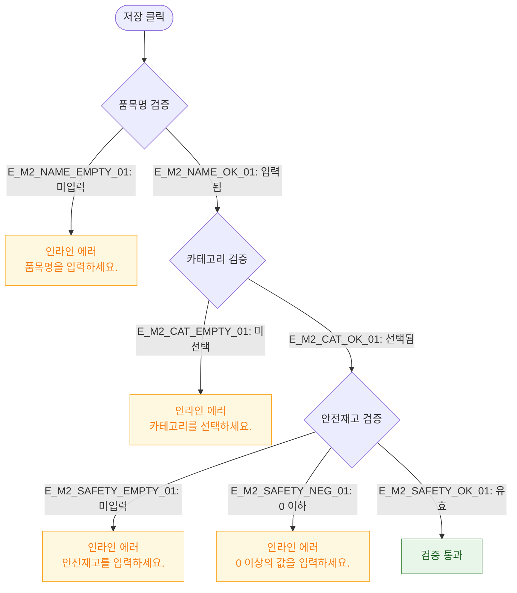

# M2 필드 검증 — DLG-057-001 소모품 등록 🆕

## 다이어그램

```mermaid
flowchart TD
    SUBMIT([저장 클릭]) --> V1{품목명 검증}
    V1 -->|"E_M2_NAME_EMPTY_01: 미입력"| ErrName[인라인 에러\n품목명을 입력하세요.]
    V1 -->|"E_M2_NAME_OK_01: 입력됨"| V2{카테고리 검증}
    V2 -->|"E_M2_CAT_EMPTY_01: 미선택"| ErrCat[인라인 에러\n카테고리를 선택하세요.]
    V2 -->|"E_M2_CAT_OK_01: 선택됨"| V3{안전재고 검증}
    V3 -->|"E_M2_SAFETY_EMPTY_01: 미입력"| ErrSafety[인라인 에러\n안전재고를 입력하세요.]
    V3 -->|"E_M2_SAFETY_NEG_01: 0 이하"| ErrNeg[인라인 에러\n0 이상의 값을 입력하세요.]
    V3 -->|"E_M2_SAFETY_OK_01: 유효"| PASS[검증 통과]

    classDef warning fill:#FFF8E1,stroke:#F9A825,color:#F57F17
    classDef success fill:#E8F5E9,stroke:#2E7D32,color:#1B5E20
    class ErrName,ErrCat,ErrSafety,ErrNeg warning
    class PASS success
```

## TC 후보

| TC ID | 타입 | Given | When | Then |
|-------|------|-------|------|------|
| - | negative | 품목명 미입력 | 저장 클릭 | 인라인 에러 표시 |
