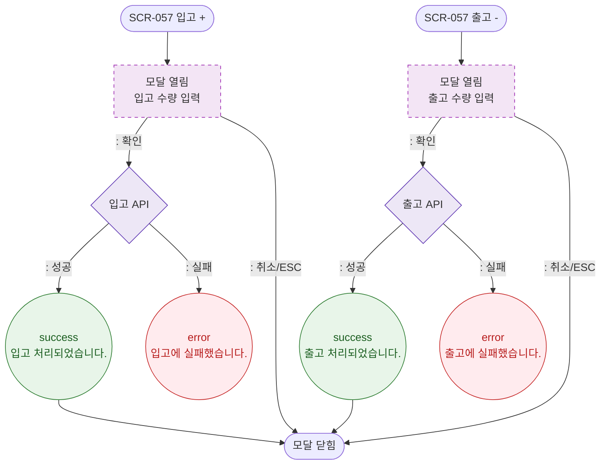

# M1 모달 생명주기 — DLG-057-002 입출고 처리 🆕

## 다이어그램

## TC 후보

| TC ID | 타입 | Given | When | Then | |-------|------|-------|------|------| | TC-057-002 | positive | 입고 모달 | 수량 입력 후 확인 | 현재고 증가 | | TC-057-003 | positive | 출고 모달 | 수량 입력 후 확인 | 현재고 감소 |
