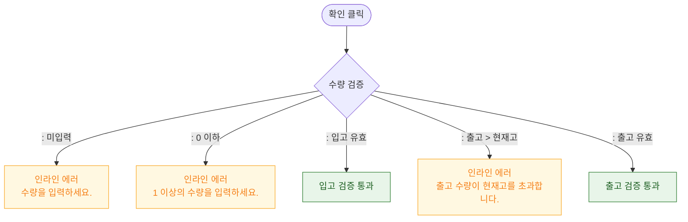

# M2 필드 검증 — DLG-057-002 입출고 처리 🆕

## 다이어그램

## TC 후보

| TC ID | 타입 | Given | When | Then | |-------|------|-------|------|------| | TC-057-004 | negative | 출고 수량 > 현재고 | 확인 클릭 | 인라인 에러 "출고 수량이 현재고를 초과합니다." |
