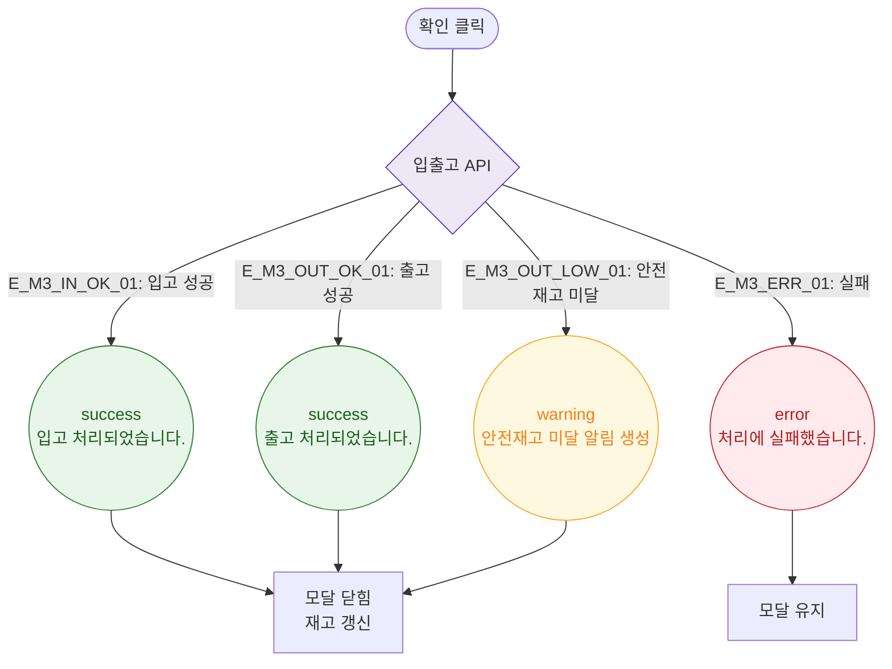

# M3 결과 분기 — DLG-057-002 입출고 처리 🆕

## 다이어그램

```mermaid
flowchart TD
    ACTION([확인 클릭]) --> API{입출고 API}
    API -->|E_M3_IN_OK_01: 입고 성공| InToast((success\n입고 처리되었습니다.))
    API -->|E_M3_OUT_OK_01: 출고 성공| OutToast((success\n출고 처리되었습니다.))
    API -->|E_M3_OUT_LOW_01: 안전재고 미달| LowWarn((warning\n안전재고 미달 알림 생성))
    API -->|E_M3_ERR_01: 실패| ErrToast((error\n처리에 실패했습니다.))
    InToast & OutToast & LowWarn --> CLOSE[모달 닫힘\n재고 갱신]
    ErrToast --> STAY[모달 유지]

    classDef success fill:#E8F5E9,stroke:#2E7D32,color:#1B5E20
    classDef warning fill:#FFF8E1,stroke:#F9A825,color:#F57F17
    classDef error fill:#FFEBEE,stroke:#C62828,color:#B71C1C
    classDef system fill:#EDE7F6,stroke:#5E35B2
    class InToast,OutToast success
    class LowWarn warning
    class ErrToast error
    class API system
```

## TC 후보

| TC ID | 타입 | Given | When | Then |
|-------|------|-------|------|------|
| - | - | - | - | - |
