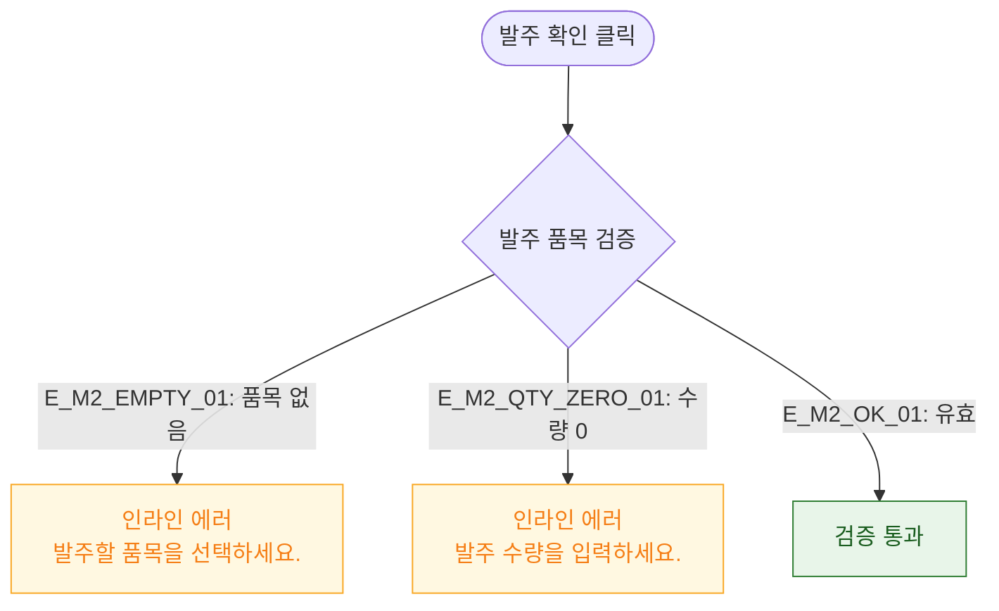

# M2 필드 검증 — DLG-057-003 발주 생성 🆕

## 다이어그램

```mermaid
flowchart TD
    SUBMIT([발주 확인 클릭]) --> V1{발주 품목 검증}
    V1 -->|E_M2_EMPTY_01: 품목 없음| ErrEmpty[인라인 에러\n발주할 품목을 선택하세요.]
    V1 -->|E_M2_QTY_ZERO_01: 수량 0| ErrQty[인라인 에러\n발주 수량을 입력하세요.]
    V1 -->|E_M2_OK_01: 유효| PASS[검증 통과]

    classDef warning fill:#FFF8E1,stroke:#F9A825,color:#F57F17
    classDef success fill:#E8F5E9,stroke:#2E7D32,color:#1B5E20
    class ErrEmpty,ErrQty warning
    class PASS success
```

## TC 후보

| TC ID | 타입 | Given | When | Then |
|-------|------|-------|------|------|
| - | - | - | - | - |
