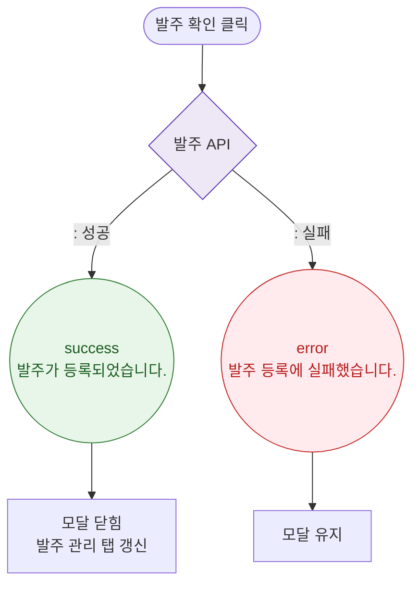

# M3 결과 분기 — DLG-057-003 발주 생성 🆕

## 다이어그램

```mermaid
flowchart TD
    ACTION([발주 확인 클릭]) --> OrderAPI{발주 API}
    OrderAPI -->|": 성공"|SuccessToast((success\n발주가 등록되었습니다.))
    OrderAPI -->|": 실패"|ErrToast((error\n발주 등록에 실패했습니다.))
    SuccessToast --> CLOSE[모달 닫힘\n발주 관리 탭 갱신]
    ErrToast --> STAY[모달 유지]

    classDef success fill:#E8F5E9,stroke:#2E7D32,color:#1B5E20
    classDef error fill:#FFEBEE,stroke:#C62828,color:#B71C1C
    classDef system fill:#EDE7F6,stroke:#5E35B2
    class SuccessToast success
    class ErrToast error
    class OrderAPI system
```

## TC 후보

| TC ID | 타입 | Given | When | Then | |-------|------|-------|------|------| | - | - | - | - | - |
