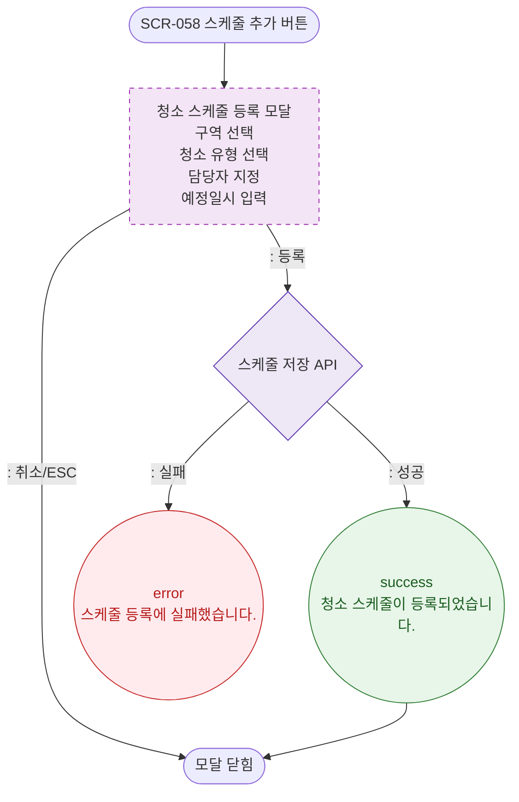

# M1 모달 생명주기 — DLG-058-001 청소 스케줄 등록 🆕

## 다이어그램

## TC 후보

| TC ID | 타입 | Given | When | Then | |-------|------|-------|------|------| | TC-058-001 | positive | 청소 스케줄 등록 모달 | 필수 항목 입력 후 등록 클릭 | 스케줄 추가, 목록 갱신 |
