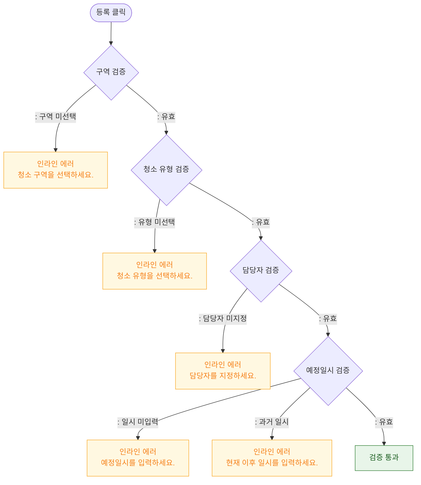

# M2 필드 검증 — DLG-058-001 청소 스케줄 등록 🆕

## 다이어그램

## TC 후보

| TC ID | 타입 | Given | When | Then | |-------|------|-------|------|------| | - | negative | 구역 미선택 | 등록 클릭 | 구역 선택 에러 표시 | | - | negative | 예정일시 과거 입력 | 등록 클릭 | 과거 일시 에러 표시 |
