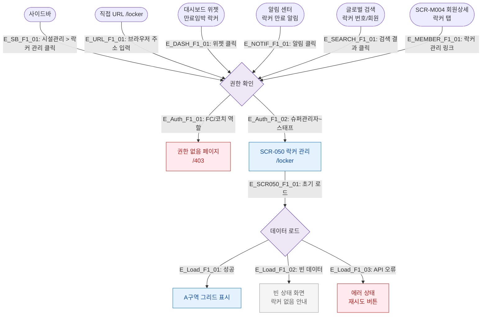

# F1 진입 플로우 — SCR-050 락커 관리

## 1. 목적
락커 관리 화면(`/locker`)으로 진입 가능한 모든 경로를 정의하여 진입 TC의 원천으로 활용한다.

## 2. 전제조건
- 로그인 상태
- 역할: 슈퍼관리자/센터장/매니저/스태프 (FC·코치는 접근 불가)

## 3. 다이어그램

## 4. 엣지 설명

| 엣지 ID | 출발 | 도착 | 조건/액션 |
|---------|------|------|-----------|
| E_SB_F1_01 | 사이드바 | 권한확인 | 시설관리 > 락커 관리 메뉴 클릭 |
| E_URL_F1_01 | 직접URL | 권한확인 | `/locker` 직접 접근 |
| E_DASH_F1_01 | 대시보드위젯 | 권한확인 | 만료임박 락커 위젯 클릭 |
| E_NOTIF_F1_01 | 알림센터 | 권한확인 | 락커 만료 알림 클릭 |
| E_SEARCH_F1_01 | 글로벌검색 | 권한확인 | 락커/회원 검색 결과 클릭 |
| E_MEMBER_F1_01 | 회원상세 | 권한확인 | 회원상세 락커 탭 링크 |
| E_Auth_F1_01 | 권한확인 | Blocked | FC/코치 역할 → 403 |
| E_Auth_F1_02 | 권한확인 | SCR-050 | 허용 역할 → 화면 진입 |
| E_Load_F1_01 | 데이터로드 | Grid | 락커 데이터 정상 응답 |
| E_Load_F1_02 | 데이터로드 | Empty | 락커 0건 |
| E_Load_F1_03 | 데이터로드 | ErrorPage | API 오류 |

## 5. TC 후보

| TC ID | 타입 | Given | When | Then |
|-------|:----:|-------|------|------|
| TC-050-F1-01 | positive | 매니저 로그인 | 사이드바 > 락커 관리 클릭 | /locker 진입, 그리드 표시 |
| TC-050-F1-02 | negative | FC 로그인 | /locker 직접 URL 접근 | 403 페이지 표시 |
| TC-050-F1-03 | positive | 대시보드 위젯 표시 | 만료임박 위젯 클릭 | /locker 진입 |
| TC-050-F1-04 | exception | 매니저 로그인 | API 오류 상태에서 진입 | 에러 상태 화면 + 재시도 버튼 |
