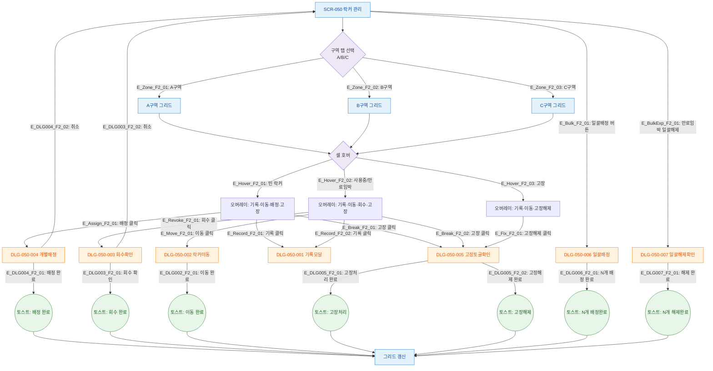

# F2 메인 인터랙션 플로우 — SCR-050 락커 관리

## 1. 목적
락커 배정·회수·이동·고장처리·일괄배정의 Happy Path와 주요 분기를 정의한다.

## 2. 전제조건
- SCR-050 정상 진입 상태
- 락커 데이터 1건 이상 존재

## 3. 다이어그램

## 4. 엣지 설명

| 엣지 ID | 출발 | 도착 | 조건/액션 |
|---------|------|------|-----------|
| E_Zone_F2_01~03 | 구역탭 | 그리드 | 탭 클릭 시 해당 구역 그리드 표시 |
| E_Hover_F2_01 | 셀호버 | 빈오버레이 | status=available |
| E_Hover_F2_02 | 셀호버 | 사용중오버레이 | status=in_use 또는 expiring |
| E_Hover_F2_03 | 셀호버 | 고장오버레이 | status=broken |
| E_Assign_F2_01 | 빈오버레이 | DLG-050-004 | 배정 버튼 클릭 |
| E_Revoke_F2_01 | 사용중오버레이 | DLG-050-003 | 회수 버튼 클릭 |
| E_Bulk_F2_01 | SCR-050 | DLG-050-006 | 일괄배정 버튼 클릭 |
| E_BulkExp_F2_01 | SCR-050 | DLG-050-007 | 만료임박 일괄해제 클릭 |

## 5. TC 후보

| TC ID | 타입 | Given | When | Then |
|-------|:----:|-------|------|------|
| TC-050-001 | positive | 락커 데이터 존재 | 페이지 진입 | 통계 카드 4개 + A구역 그리드 |
| TC-050-002 | positive | A구역 표시 중 | B구역 탭 클릭 | B존 락커만 표시 |
| TC-050-007 | positive | 빈 락커 호버 > 배정 | 회원 선택 → 만료일 → 배정 | 배정 완료 토스트 + 그리드 갱신 |
| TC-050-009 | positive | 사용중 락커 | 회수 → 확인 | 회수 완료 토스트, available 전환 |
| TC-050-011 | positive | 빈 락커 | 고장 → 확인 | 고장 처리 토스트, broken 전환 |
| TC-050-013 | positive | 아무 락커 | 이동 → 번호 → 확인 | 이동 완료 토스트 |
| TC-050-018 | positive | 3개 빈 락커 선택 | 일괄배정 → 회원 → 배정 | 3개 배정 완료 토스트 |
| TC-050-019 | positive | 만료임박 5개 | 일괄해제 → 확인 | 5개 해제 완료 토스트 |
