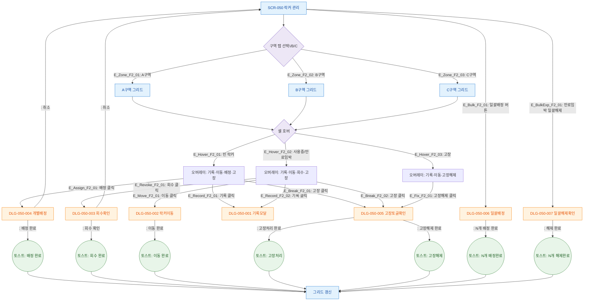

# F2 메인 인터랙션 플로우 — SCR-050 락커 관리

## 1. 목적
락커 배정·회수·이동·고장처리·일괄배정의 Happy Path와 주요 분기를 정의한다.

## 2. 전제조건
- SCR-050 정상 진입 상태
- 락커 데이터 1건 이상 존재

## 3. 다이어그램

## 4. 엣지 설명

| 출발 | 도착 | 조건/액션 | |---------|------|------|-----------| | E_Zone_F2_01~03 | 구역탭 | 그리드 | 탭 클릭 시 해당 구역 그리드 표시 | | E_Hover_F2_01 | 셀호버 | 빈오버레이 | status=available | | E_Hover_F2_02 | 셀호버 | 사용중오버레이 | status=in_use 또는 expiring | | E_Hover_F2_03 | 셀호버 | 고장오버레이 | status=broken | | E_Assign_F2_01 | 빈오버레이 | DLG-050-004 | 배정 버튼 클릭 | | E_Revoke_F2_01 | 사용중오버레이 | DLG-050-003 | 회수 버튼 클릭 | | E_Bulk_F2_01 | SCR-050 | DLG-050-006 | 일괄배정 버튼 클릭 | | E_BulkExp_F2_01 | SCR-050 | DLG-050-007 | 만료임박 일괄해제 클릭 |
