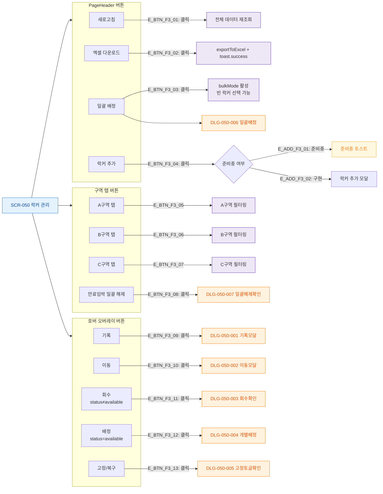

# F3 버튼/액션 매핑 — SCR-050 락커 관리

## 1. 목적
화면 내 모든 버튼을 노드화하여 버튼별 동작 TC의 원천으로 활용한다.

## 2. 전제조건
- SCR-050 정상 진입 상태

## 3. 다이어그램

## 4. 엣지 설명

| 엣지 ID | 버튼 | 동작 |
|---------|------|------|
| E_BTN_F3_01 | 새로고침 | 전체 데이터 재조회 |
| E_BTN_F3_02 | 엑셀 다운로드 | exportToExcel() + toast |
| E_BTN_F3_03 | 일괄 배정 | bulkMode 활성 → DLG-050-006 |
| E_BTN_F3_04 | 락커 추가 | 준비중 toast 또는 추가 모달 |
| E_BTN_F3_05~07 | 구역 탭 | 해당 구역 필터링 |
| E_BTN_F3_08 | 만료임박 일괄해제 | DLG-050-007 |
| E_BTN_F3_09~13 | 호버 오버레이 버튼 | 각 DLG 트리거 |

## 5. TC 후보

| TC ID | 타입 | Given | When | Then |
|-------|:----:|-------|------|------|
| TC-050-020 | positive | 락커 데이터 존재 | 엑셀 다운로드 버튼 클릭 | 파일 다운로드 + toast |
| TC-050-021 | positive | 데이터 존재 | 새로고침 버튼 클릭 | 전체 데이터 재조회 |
| TC-050-005 | positive | 빈 락커 존재 | 빈 락커 셀 호버 | 기록·이동·배정·고장 오버레이 표시 |
| TC-050-006 | positive | 사용중 락커 존재 | 사용중 셀 호버 | 기록·이동·회수·고장 오버레이 표시 |
