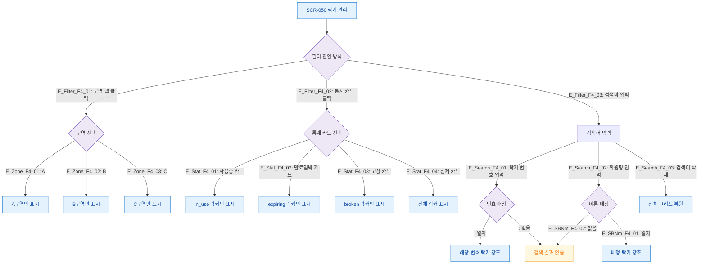

# F4 필터/검색/정렬 플로우 — SCR-050 락커 관리

## 1. 목적
구역 탭 필터·검색바·통계 카드 클릭 필터의 조합 동작을 정의한다.

## 2. 전제조건
- SCR-050 정상 진입, 락커 데이터 존재

## 3. 다이어그램

## 4. 엣지 설명

| 출발 | 도착 | 조건 | |---------|------|------|------| | E_Filter_F4_01 | 필터진입 | 구역탭 | 탭 클릭 | | E_Filter_F4_02 | 필터진입 | 통계카드 | 카드 클릭 | | E_Filter_F4_03 | 필터진입 | 검색바 | 텍스트 입력 | | E_Zone_F4_01~03 | 구역선택 | 그리드 | 구역별 필터링 | | E_Stat_F4_01~04 | 통계카드 | 결과 | 상태별 필터링 | | E_Search_F4_01~02 | 검색입력 | 매칭 | 번호/회원명 검색 |
