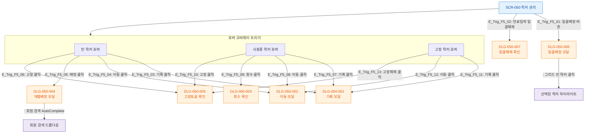

# F5 모달 트리거 트리 — SCR-050 락커 관리

## 1. 목적
SCR-050에서 트리거되는 모든 DLG의 진입 경로와 계층 구조를 정의한다.

## 2. 전제조건
- SCR-050 정상 진입

## 3. 다이어그램

## 4. 엣지 설명

| 트리거 위치 | 대상 DLG | 조건 | |---------|------------|---------|------| | E_Trig_F5_01 | PageHeader 일괄배정 | DLG-050-006 | 버튼 클릭 | | E_Trig_F5_02 | 탭 우측 만료임박일괄해제 | DLG-050-007 | 버튼 클릭 | | E_Trig_F5_03~06 | 빈 락커 호버 오버레이 | DLG-001~005 | 각 버튼 클릭 | | E_Trig_F5_07~10 | 사용중 락커 호버 오버레이 | DLG-001~005 | 각 버튼 클릭 | | E_Trig_F5_11~13 | 고장 락커 호버 오버레이 | DLG-001,002,005 | 각 버튼 클릭 |
