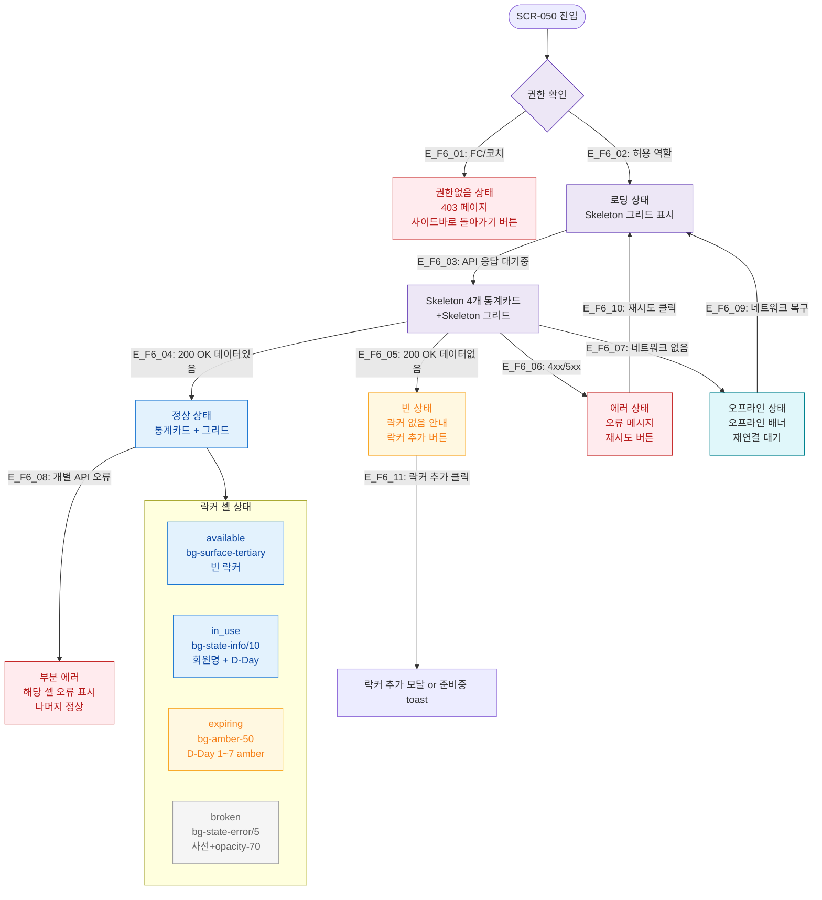

# F6 상태별 화면 플로우 — SCR-050 락커 관리

## 1. 목적
로딩/빈/에러/권한없음/오프라인 등 UI 상태별 분기를 정의한다.

## 2. 전제조건
- SCR-050 진입 시도

## 3. 다이어그램

## 4. 엣지 설명

| 엣지 ID | 상태 | 전환 조건 |
|---------|------|-----------|
| E_F6_01 | → 권한없음 | FC/코치 역할 접근 |
| E_F6_03 | → 로딩 UI | API 응답 대기 |
| E_F6_04 | → 정상 | 200 + 데이터 존재 |
| E_F6_05 | → 빈 상태 | 200 + 데이터 0건 |
| E_F6_06 | → 에러 | 4xx/5xx |
| E_F6_07 | → 오프라인 | 네트워크 없음 |
| E_F6_09 | → 로딩 | 네트워크 복구 |
| E_F6_10 | → 로딩 | 재시도 버튼 |

## 5. TC 후보

| TC ID | 타입 | Given | When | Then |
|-------|:----:|-------|------|------|
| TC-050-022 | positive | D-5 락커 | 화면 확인 | amber 배경, D-5 라벨, text-amber-600 |
| TC-050-023 | positive | D-0 락커 | 화면 확인 | text-state-error, D-0 라벨 |
| TC-050-F6-01 | negative | FC 로그인 | /locker 접근 | 403 페이지 |
| TC-050-F6-02 | exception | API 500 | 페이지 로드 | 에러 상태 + 재시도 버튼 |
| TC-050-F6-03 | exception | 락커 0건 | 페이지 로드 | 빈 상태 + 락커 추가 버튼 |
| TC-050-F6-04 | exception | 오프라인 | 페이지 로드 | 오프라인 배너 표시 |
