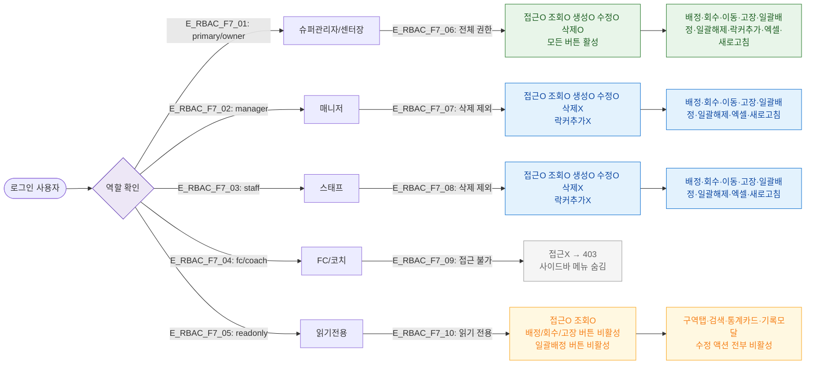

# F7 권한(RBAC) 분기 플로우 — SCR-050 락커 관리

## 1. 목적
6개 역할별 접근 가능 범위와 버튼 활성화 조건을 정의한다.

## 2. 전제조건
- 로그인 상태, /locker 접근 시도

## 3. 다이어그램

## 4. 엣지 설명

| 엣지 ID | 역할 | 접근 수준 |
|---------|------|-----------|
| E_RBAC_F7_01 | primary/owner | 전체 CRUD + 락커추가 |
| E_RBAC_F7_02 | manager | CRUD(삭제·락커추가 제외) |
| E_RBAC_F7_03 | staff | CRUD(삭제·락커추가 제외) |
| E_RBAC_F7_04 | fc/coach | 접근 불가 → 403 |
| E_RBAC_F7_05 | readonly | 조회만, 수정 버튼 비활성 |

## 5. TC 후보

| TC ID | 타입 | Given | When | Then |
|-------|:----:|-------|------|------|
| TC-050-F7-01 | positive | 매니저 로그인 | /locker 접근 | 정상 진입, 배정/회수/이동 버튼 활성 |
| TC-050-F7-02 | negative | FC 로그인 | /locker 접근 | 403 페이지 |
| TC-050-F7-03 | negative | readonly | 배정 버튼 확인 | 버튼 비활성(disabled) 상태 |
| TC-050-F7-04 | positive | 슈퍼관리자 | 락커추가 버튼 확인 | 버튼 활성 |
