# F8 에러/예외/복구 플로우 — SCR-050 락커 관리

## 1. 목적
각 액션별 에러 분기와 복구 경로를 정의하여 네거티브 TC의 원천으로 활용한다.

## 2. 전제조건
- SCR-050 정상 진입 상태

## 3. 다이어그램

```mermaid
flowchart TD
    SCR050[SCR-050 락커 관리]

    subgraph LoadErr["초기 로드 에러"]
        SCR050 -->|E_Err_F8_01: 페이지 로드| APILoad{GET /api/lockers}
        APILoad -->|E_Err_F8_02: 500| ErrLoad[에러 화면\n재시도 버튼]
        APILoad -->|E_Err_F8_03: 401| ErrAuth[세션만료\n로그인 리다이렉트]
        APILoad -->|E_Err_F8_04: 403| ErrPerm[권한없음 403]
        APILoad -->|E_Err_F8_05: Timeout| ErrTimeout[타임아웃\n재시도 버튼]
        ErrLoad -->|E_Err_F8_06: 재시도| APILoad
        ErrTimeout -->|E_Err_F8_07: 재시도| APILoad
    end

    subgraph AssignErr["배정 에러"]
        DLG004[DLG-050-004 개별배정] -->|E_Err_F8_08: 배정 요청| APIAssign{PATCH /api/lockers/:id}
        APIAssign -->|E_Err_F8_09: 회원 미선택| ErrNoMember[/배정할 회원을 선택해주세요/]
        APIAssign -->|E_Err_F8_10: 만료일 누락| ErrNoDate[/만료일을 입력해주세요/]
        APIAssign -->|E_Err_F8_11: 409 이미 배정| ErrConflict[/이미 배정된 락커입니다/]
        APIAssign -->|E_Err_F8_12: 500| ErrServer[/락커 배정에 실패했습니다/]
        ErrNoMember --> DLG004
        ErrNoDate --> DLG004
        ErrConflict --> DLG004
        ErrServer --> DLG004
    end

    subgraph MoveErr["이동 에러"]
        DLG002[DLG-050-002 이동모달] -->|E_Err_F8_13: 이동 요청| APIMove{PATCH /api/lockers/:id/move}
        APIMove -->|E_Err_F8_14: 번호 미입력| ErrNoNum[/이동할 락커 번호를 입력해주세요/]
        APIMove -->|E_Err_F8_15: 중복 번호| ErrDupNum[/이미 존재하는 번호입니다/]
        APIMove -->|E_Err_F8_16: 500| ErrMoveServer[/락커 이동에 실패했습니다/]
        ErrNoNum --> DLG002
        ErrDupNum --> DLG002
        ErrMoveServer --> DLG002
    end

    subgraph BulkErr["일괄 에러"]
        DLG006[DLG-050-006 일괄배정] -->|E_Err_F8_17: 선택 0개| ErrNoSel[/배정할 락커를 선택해주세요/]
        DLG006 -->|E_Err_F8_18: 500 일부 실패| ErrPartial[/일부 락커 배정에 실패했습니다/]
        ErrNoSel --> DLG006
        ErrPartial --> DLG006
    end

    classDef screen fill:#E3F2FD,stroke:#1976D2,color:#0D47A1
    classDef modal fill:#FFF3E0,stroke:#F57C00,color:#E65100
    classDef error fill:#FFEBEE,stroke:#C62828,color:#B71C1C
    classDef system fill:#EDE7F6,stroke:#5E35B2

    class SCR050 screen
    class DLG002,DLG004,DLG006 modal
    class ErrLoad,ErrAuth,ErrPerm,ErrTimeout,ErrNoMember,ErrNoDate,ErrConflict,ErrServer,ErrNoNum,ErrDupNum,ErrMoveServer,ErrNoSel,ErrPartial error
    class APILoad,APIAssign,APIMove system
```

## 4. 엣지 설명

| 엣지 ID | 에러 조건 | 복구 방법 |
|---------|-----------|-----------|
| E_Err_F8_02 | 500 서버 오류 | 재시도 버튼 |
| E_Err_F8_03 | 401 세션만료 | 로그인 리다이렉트 |
| E_Err_F8_09 | 회원 미선택 | 폼 재입력 |
| E_Err_F8_10 | 만료일 누락 | 폼 재입력 |
| E_Err_F8_11 | 409 충돌 | 다른 락커 선택 |
| E_Err_F8_14 | 번호 미입력 | 번호 입력 후 재시도 |
| E_Err_F8_15 | 중복 번호 | 다른 번호 입력 |

## 5. TC 후보

| TC ID | 타입 | Given | When | Then |
|-------|:----:|-------|------|------|
| TC-050-008 | negative | 배정 모달 | 회원 미선택 → 배정 | "배정할 회원을 선택해주세요" 토스트 |
| TC-050-014 | negative | 이동 모달 | 번호 미입력 → 확인 | "이동할 락커 번호를 입력해주세요" 토스트 |
| TC-050-F8-01 | exception | API 500 | 배정 시도 | "락커 배정에 실패했습니다" 토스트 |
| TC-050-F8-02 | exception | 401 세션만료 | 페이지 로드 | 로그인 페이지 리다이렉트 |
