# F9 토스트/피드백 플로우 — SCR-050 락커 관리

## 1. 목적
모든 액션의 성공·경고·에러·정보 토스트 발생 조건을 정의한다.

## 2. 전제조건
- SCR-050에서 각 액션 수행 후

## 3. 다이어그램

```mermaid
flowchart TD
    Actions([SCR-050 액션 수행])

    subgraph SuccessToasts["success 토스트"]
        T_S1((이동 완료\n락커가 N번으로 이동되었습니다))
        T_S2((회수 완료\n락커가 회수되었습니다))
        T_S3((고장 처리\n고장 처리되었습니다))
        T_S4((고장 해제\n고장 해제되었습니다))
        T_S5((개별 배정\번 락커가 M님께 배정되었습니다))
        T_S6((일괄 배정\개 락커가 M님께 배정되었습니다))
        T_S7((일괄 해제\개 락커가 일괄 해제되었습니다))
        T_S8((기록 저장\n비밀번호/메모가 저장되었습니다))
        T_S9((엑셀 완료\n엑셀 다운로드가 완료되었습니다))
    end

    subgraph ErrorToasts["error 토스트"]
        T_E1[/배정할 회원을 선택해주세요/]
        T_E2[/만료일을 입력해주세요/]
        T_E3[/이동할 락커 번호를 입력해주세요/]
        T_E4[/락커 배정에 실패했습니다/]
        T_E5[/락커 이동에 실패했습니다/]
        T_E6[/락커 회수에 실패했습니다/]
        T_E7[/이미 배정된 락커입니다/]
        T_E8[/이미 존재하는 번호입니다/]
    end

    subgraph WarnToasts["warning 토스트"]
        T_W1[만료임박 락커 N건\n일괄 해제 대상]
    end

    subgraph InfoToasts["info 토스트"]
        T_I1[락커 추가 기능\n준비중입니다]
    end

    Actions -->|"E_Toast_F9_01: 이동 API 200"|T_S1
    Actions -->|"E_Toast_F9_02: 회수 API 200"|T_S2
    Actions -->|"E_Toast_F9_03: 고장처리 API 200"|T_S3
    Actions -->|"E_Toast_F9_04: 고장해제 API 200"|T_S4
    Actions -->|"E_Toast_F9_05: 개별배정 API 200"|T_S5
    Actions -->|"E_Toast_F9_06: 일괄배정 API 200"|T_S6
    Actions -->|"E_Toast_F9_07: 일괄해제 API 200"|T_S7
    Actions -->|"E_Toast_F9_08: 기록저장 API 200"|T_S8
    Actions -->|"E_Toast_F9_09: 엑셀 완료"|T_S9
    Actions -->|"E_Toast_F9_10: 회원 미선택"|T_E1
    Actions -->|"E_Toast_F9_11: 만료일 누락"|T_E2
    Actions -->|"E_Toast_F9_12: 번호 미입력"|T_E3
    Actions -->|"E_Toast_F9_13: 배정 API 5xx"|T_E4
    Actions -->|"E_Toast_F9_14: 이동 API 5xx"|T_E5
    Actions -->|"E_Toast_F9_15: 회수 API 5xx"|T_E6
    Actions -->|"E_Toast_F9_16: 409 충돌"|T_E7
    Actions -->|"E_Toast_F9_17: 중복 번호"|T_E8
    Actions -->|"E_Toast_F9_18: 만료임박 존재 알림"|T_W1
    Actions -->|"E_Toast_F9_19: 락커추가 준비중"|T_I1

    classDef success fill:#E8F5E9,stroke:#2E7D32,color:#1B5E20
    classDef error fill:#FFEBEE,stroke:#C62828,color:#B71C1C
    classDef warning fill:#FFF8E1,stroke:#F9A825,color:#F57F17
    classDef info fill:#E0F7FA,stroke:#00838F
    classDef system fill:#EDE7F6,stroke:#5E35B2

    class T_S1,T_S2,T_S3,T_S4,T_S5,T_S6,T_S7,T_S8,T_S9 success
    class T_E1,T_E2,T_E3,T_E4,T_E5,T_E6,T_E7,T_E8 error
    class T_W1 warning
    class T_I1 info
    class Actions system
```

## 4. 엣지 설명

| 발생 조건 | 토스트 타입 | |---------|-----------|------------| | E_Toast_F9_01~09 | API 200 OK | success | | E_Toast_F9_10~17 | 검증 실패 / API 5xx / 409 | error | | E_Toast_F9_18 | 만료임박 존재 | warning | | E_Toast_F9_19 | 준비중 기능 접근 | info |
